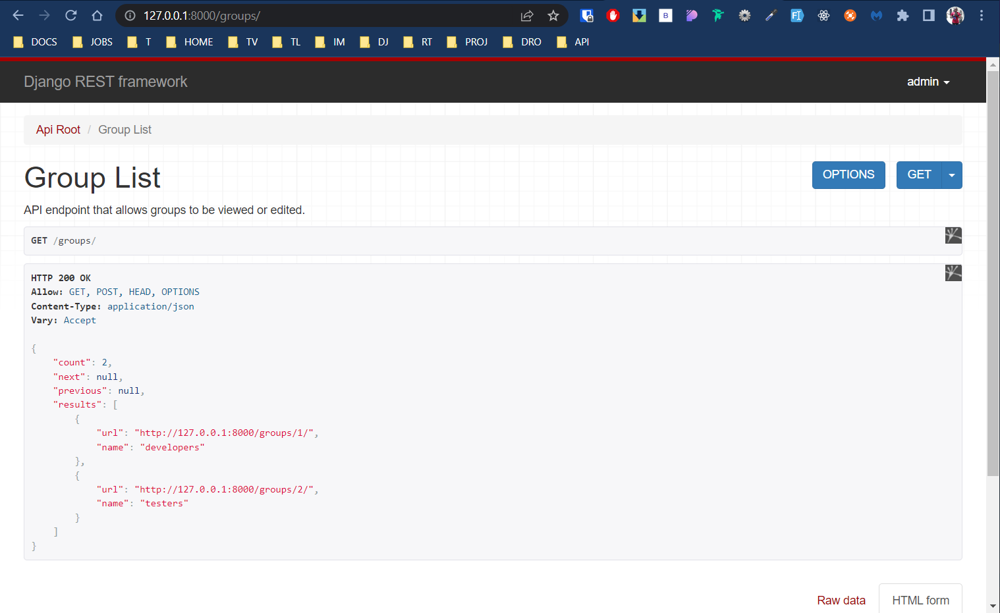
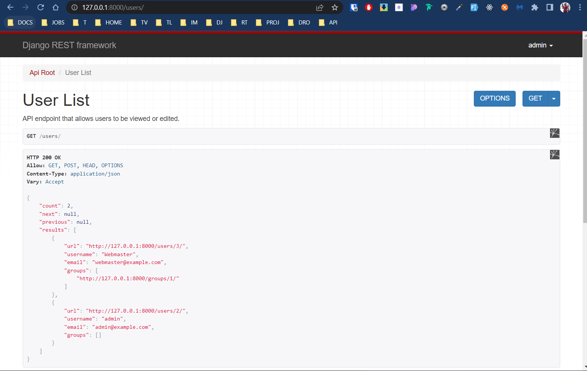

# Django-RF-Docs-Tutorial

Django-RF-Docs-Tutorial By Ifeanyi Omeata

## Tutorial

---

### [0-PYTHON](#)

---

<details>
  <summary>0. Python Classes</summary>

```python
class Person:
  pass

p1 = Person()
p2 = Person()

p1.name = "Bob"
p1.age = 30

p2.name = "Henry"
p2.age = 25

print(p1.name, p1.age) #Bob 30
print(p2.name, p2.age) #Henry 25

```

</details>

<details>
  <summary>1. Class Initializer</summary>

```python
class Person:
  def __init__(self, name, age):
    self.name = name
    self.age = age

p1 = Person("Brad", 32)
p2 = Person("Tommy", 21)

print(p1.name, p1.age) #Brad 32
print(p2.name, p2.age) #Tommy 21

```

</details>

<details>
  <summary>2. Class Attributes</summary>

```python
class Person:
  email = "mymail@example.com"

  def __init__(self, name, age):
    self.name = name
    self.age = age

p1 = Person("Brad", 32)
p2 = Person("Tommy", 21)

print(p1.name, p1.age, p1.email) #Brad 32 mymail@example.com
print(p2.name, p2.age, p2.email) #Tommy 21 mymail@example.com
```

</details>

<details>
  <summary>3. Class Methods</summary>

```python
class Person:
  email = "mymail@example.com"

  def __init__(self, name, age, email):
    self.name = name
    self.age = age
    self.email = email

  def print_info(self):
    print(f'My name is {self.name}, I am {self.age} years old, and my email is {self.email}.')

p1 = Person("Brad", 32, "brad@example.com")
p1.print_info()
#My name is Brad, I am 32 years old, and my email is brad@example.com.
```

</details>

<details>
  <summary>4. Class Inheritance</summary>

```python
class Person:
  def __init__(self, name, email):
    self.name = name
    self.email = email

  def full_info(self):
    print(f'Name is {self.name}, and Email is {self.email}.')

class Student(Person):
  pass

p1 = Student("Brad", "brad@example.com")
p1.full_info()
#Name is Brad, and Email is brad@example.com
```

</details>

<details>
  <summary>0. Serializers</summary>

```python

```

</details>

<details>
  <summary>0. Serializers</summary>

```python

```

</details>

<details>
  <summary>0. Serializers</summary>

```python

```

</details>

<details>
  <summary>0. Serializers</summary>

```python

```

</details>

---

### [0-DOCS](#)

---

<details>
  <summary>0. Serializers</summary>

#################################################
#################################################
#################################################
#################################################
#################################################
#################################################
#################################################

```python
"""
Serializers and ModelSerializers are similar to Forms and ModelForms.
Unlike forms, they are not constrained to dealing with HTML output, and
form encoded input.

Serialization in REST framework is a two-phase process:

1. Serializers marshal between complex types like model instances, and
python primitives.
2. The process of marshalling between python primitives and request and
response content is handled by parsers and renderers.
"""
import copy
import inspect
import traceback
from collections import OrderedDict, defaultdict
from collections.abc import Mapping

from django.core.exceptions import FieldDoesNotExist, ImproperlyConfigured
from django.core.exceptions import ValidationError as DjangoValidationError
from django.db import models
from django.db.models.fields import Field as DjangoModelField
from django.utils import timezone
from django.utils.functional import cached_property
from django.utils.translation import gettext_lazy as _

from rest_framework.compat import postgres_fields
from rest_framework.exceptions import ErrorDetail, ValidationError
from rest_framework.fields import get_error_detail, set_value
from rest_framework.settings import api_settings
from rest_framework.utils import html, model_meta, representation
from rest_framework.utils.field_mapping import (
    ClassLookupDict, get_field_kwargs, get_nested_relation_kwargs,
    get_relation_kwargs, get_url_kwargs
)
from rest_framework.utils.serializer_helpers import (
    BindingDict, BoundField, JSONBoundField, NestedBoundField, ReturnDict,
    ReturnList
)
from rest_framework.validators import (
    UniqueForDateValidator, UniqueForMonthValidator, UniqueForYearValidator,
    UniqueTogetherValidator
)

# Note: We do the following so that users of the framework can use this style:
#
#     example_field = serializers.CharField(...)
#
# This helps keep the separation between model fields, form fields, and
# serializer fields more explicit.
from rest_framework.fields import (  # NOQA # isort:skip
    BooleanField, CharField, ChoiceField, DateField, DateTimeField, DecimalField,
    DictField, DurationField, EmailField, Field, FileField, FilePathField, FloatField,
    HiddenField, HStoreField, IPAddressField, ImageField, IntegerField, JSONField,
    ListField, ModelField, MultipleChoiceField, NullBooleanField, ReadOnlyField,
    RegexField, SerializerMethodField, SlugField, TimeField, URLField, UUIDField,
)
from rest_framework.relations import (  # NOQA # isort:skip
    HyperlinkedIdentityField, HyperlinkedRelatedField, ManyRelatedField,
    PrimaryKeyRelatedField, RelatedField, SlugRelatedField, StringRelatedField,
)

# Non-field imports, but public API
from rest_framework.fields import (  # NOQA # isort:skip
    CreateOnlyDefault, CurrentUserDefault, SkipField, empty
)
from rest_framework.relations import Hyperlink, PKOnlyObject  # NOQA # isort:skip

# We assume that 'validators' are intended for the child serializer,
# rather than the parent serializer.
LIST_SERIALIZER_KWARGS = (
    'read_only', 'write_only', 'required', 'default', 'initial', 'source',
    'label', 'help_text', 'style', 'error_messages', 'allow_empty',
    'instance', 'data', 'partial', 'context', 'allow_null',
    'max_length', 'min_length'
)

ALL_FIELDS = '__all__'


# BaseSerializer
# --------------

class BaseSerializer(Field):
    """
    The BaseSerializer class provides a minimal class which may be used
    for writing custom serializer implementations.

    Note that we strongly restrict the ordering of operations/properties
    that may be used on the serializer in order to enforce correct usage.

    In particular, if a `data=` argument is passed then:

    .is_valid() - Available.
    .initial_data - Available.
    .validated_data - Only available after calling `is_valid()`
    .errors - Only available after calling `is_valid()`
    .data - Only available after calling `is_valid()`

    If a `data=` argument is not passed then:

    .is_valid() - Not available.
    .initial_data - Not available.
    .validated_data - Not available.
    .errors - Not available.
    .data - Available.
    """

    def __init__(self, instance=None, data=empty, **kwargs):
        self.instance = instance
        if data is not empty:
            self.initial_data = data
        self.partial = kwargs.pop('partial', False)
        self._context = kwargs.pop('context', {})
        kwargs.pop('many', None)
        super().__init__(**kwargs)

    def __new__(cls, *args, **kwargs):
        # We override this method in order to automatically create
        # `ListSerializer` classes instead when `many=True` is set.
        if kwargs.pop('many', False):
            return cls.many_init(*args, **kwargs)
        return super().__new__(cls, *args, **kwargs)

    # Allow type checkers to make serializers generic.
    def __class_getitem__(cls, *args, **kwargs):
        return cls

    @classmethod
    def many_init(cls, *args, **kwargs):
        """
        This method implements the creation of a `ListSerializer` parent
        class when `many=True` is used. You can customize it if you need to
        control which keyword arguments are passed to the parent, and
        which are passed to the child.

        Note that we're over-cautious in passing most arguments to both parent
        and child classes in order to try to cover the general case. If you're
        overriding this method you'll probably want something much simpler, eg:

        @classmethod
        def many_init(cls, *args, **kwargs):
            kwargs['child'] = cls()
            return CustomListSerializer(*args, **kwargs)
        """
        allow_empty = kwargs.pop('allow_empty', None)
        max_length = kwargs.pop('max_length', None)
        min_length = kwargs.pop('min_length', None)
        child_serializer = cls(*args, **kwargs)
        list_kwargs = {
            'child': child_serializer,
        }
        if allow_empty is not None:
            list_kwargs['allow_empty'] = allow_empty
        if max_length is not None:
            list_kwargs['max_length'] = max_length
        if min_length is not None:
            list_kwargs['min_length'] = min_length
        list_kwargs.update({
            key: value for key, value in kwargs.items()
            if key in LIST_SERIALIZER_KWARGS
        })
        meta = getattr(cls, 'Meta', None)
        list_serializer_class = getattr(meta, 'list_serializer_class', ListSerializer)
        return list_serializer_class(*args, **list_kwargs)

    def to_internal_value(self, data):
        raise NotImplementedError('`to_internal_value()` must be implemented.')

    def to_representation(self, instance):
        raise NotImplementedError('`to_representation()` must be implemented.')

    def update(self, instance, validated_data):
        raise NotImplementedError('`update()` must be implemented.')

    def create(self, validated_data):
        raise NotImplementedError('`create()` must be implemented.')

    def save(self, **kwargs):
        assert hasattr(self, '_errors'), (
            'You must call `.is_valid()` before calling `.save()`.'
        )

        assert not self.errors, (
            'You cannot call `.save()` on a serializer with invalid data.'
        )

        # Guard against incorrect use of `serializer.save(commit=False)`
        assert 'commit' not in kwargs, (
            "'commit' is not a valid keyword argument to the 'save()' method. "
            "If you need to access data before committing to the database then "
            "inspect 'serializer.validated_data' instead. "
            "You can also pass additional keyword arguments to 'save()' if you "
            "need to set extra attributes on the saved model instance. "
            "For example: 'serializer.save(owner=request.user)'.'"
        )

        assert not hasattr(self, '_data'), (
            "You cannot call `.save()` after accessing `serializer.data`."
            "If you need to access data before committing to the database then "
            "inspect 'serializer.validated_data' instead. "
        )

        validated_data = {**self.validated_data, **kwargs}

        if self.instance is not None:
            self.instance = self.update(self.instance, validated_data)
            assert self.instance is not None, (
                '`update()` did not return an object instance.'
            )
        else:
            self.instance = self.create(validated_data)
            assert self.instance is not None, (
                '`create()` did not return an object instance.'
            )

        return self.instance

    def is_valid(self, raise_exception=False):
        assert hasattr(self, 'initial_data'), (
            'Cannot call `.is_valid()` as no `data=` keyword argument was '
            'passed when instantiating the serializer instance.'
        )

        if not hasattr(self, '_validated_data'):
            try:
                self._validated_data = self.run_validation(self.initial_data)
            except ValidationError as exc:
                self._validated_data = {}
                self._errors = exc.detail
            else:
                self._errors = {}

        if self._errors and raise_exception:
            raise ValidationError(self.errors)

        return not bool(self._errors)

    @property
    def data(self):
        if hasattr(self, 'initial_data') and not hasattr(self, '_validated_data'):
            msg = (
                'When a serializer is passed a `data` keyword argument you '
                'must call `.is_valid()` before attempting to access the '
                'serialized `.data` representation.\n'
                'You should either call `.is_valid()` first, '
                'or access `.initial_data` instead.'
            )
            raise AssertionError(msg)

        if not hasattr(self, '_data'):
            if self.instance is not None and not getattr(self, '_errors', None):
                self._data = self.to_representation(self.instance)
            elif hasattr(self, '_validated_data') and not getattr(self, '_errors', None):
                self._data = self.to_representation(self.validated_data)
            else:
                self._data = self.get_initial()
        return self._data

    @property
    def errors(self):
        if not hasattr(self, '_errors'):
            msg = 'You must call `.is_valid()` before accessing `.errors`.'
            raise AssertionError(msg)
        return self._errors

    @property
    def validated_data(self):
        if not hasattr(self, '_validated_data'):
            msg = 'You must call `.is_valid()` before accessing `.validated_data`.'
            raise AssertionError(msg)
        return self._validated_data


# Serializer & ListSerializer classes
# -----------------------------------

class SerializerMetaclass(type):
    """
    This metaclass sets a dictionary named `_declared_fields` on the class.

    Any instances of `Field` included as attributes on either the class
    or on any of its superclasses will be include in the
    `_declared_fields` dictionary.
    """

    @classmethod
    def _get_declared_fields(cls, bases, attrs):
        fields = [(field_name, attrs.pop(field_name))
                  for field_name, obj in list(attrs.items())
                  if isinstance(obj, Field)]
        fields.sort(key=lambda x: x[1]._creation_counter)

        # Ensures a base class field doesn't override cls attrs, and maintains
        # field precedence when inheriting multiple parents. e.g. if there is a
        # class C(A, B), and A and B both define 'field', use 'field' from A.
        known = set(attrs)

        def visit(name):
            known.add(name)
            return name

        base_fields = [
            (visit(name), f)
            for base in bases if hasattr(base, '_declared_fields')
            for name, f in base._declared_fields.items() if name not in known
        ]

        return OrderedDict(base_fields + fields)

    def __new__(cls, name, bases, attrs):
        attrs['_declared_fields'] = cls._get_declared_fields(bases, attrs)
        return super().__new__(cls, name, bases, attrs)


def as_serializer_error(exc):
    assert isinstance(exc, (ValidationError, DjangoValidationError))

    if isinstance(exc, DjangoValidationError):
        detail = get_error_detail(exc)
    else:
        detail = exc.detail

    if isinstance(detail, Mapping):
        # If errors may be a dict we use the standard {key: list of values}.
        # Here we ensure that all the values are *lists* of errors.
        return {
            key: value if isinstance(value, (list, Mapping)) else [value]
            for key, value in detail.items()
        }
    elif isinstance(detail, list):
        # Errors raised as a list are non-field errors.
        return {
            api_settings.NON_FIELD_ERRORS_KEY: detail
        }
    # Errors raised as a string are non-field errors.
    return {
        api_settings.NON_FIELD_ERRORS_KEY: [detail]
    }


class Serializer(BaseSerializer, metaclass=SerializerMetaclass):
    default_error_messages = {
        'invalid': _('Invalid data. Expected a dictionary, but got {datatype}.')
    }

    @cached_property
    def fields(self):
        """
        A dictionary of {field_name: field_instance}.
        """
        # `fields` is evaluated lazily. We do this to ensure that we don't
        # have issues importing modules that use ModelSerializers as fields,
        # even if Django's app-loading stage has not yet run.
        fields = BindingDict(self)
        for key, value in self.get_fields().items():
            fields[key] = value
        return fields

    @property
    def _writable_fields(self):
        for field in self.fields.values():
            if not field.read_only:
                yield field

    @property
    def _readable_fields(self):
        for field in self.fields.values():
            if not field.write_only:
                yield field

    def get_fields(self):
        """
        Returns a dictionary of {field_name: field_instance}.
        """
        # Every new serializer is created with a clone of the field instances.
        # This allows users to dynamically modify the fields on a serializer
        # instance without affecting every other serializer instance.
        return copy.deepcopy(self._declared_fields)

    def get_validators(self):
        """
        Returns a list of validator callables.
        """
        # Used by the lazily-evaluated `validators` property.
        meta = getattr(self, 'Meta', None)
        validators = getattr(meta, 'validators', None)
        return list(validators) if validators else []

    def get_initial(self):
        if hasattr(self, 'initial_data'):
            # initial_data may not be a valid type
            if not isinstance(self.initial_data, Mapping):
                return OrderedDict()

            return OrderedDict([
                (field_name, field.get_value(self.initial_data))
                for field_name, field in self.fields.items()
                if (field.get_value(self.initial_data) is not empty) and
                not field.read_only
            ])

        return OrderedDict([
            (field.field_name, field.get_initial())
            for field in self.fields.values()
            if not field.read_only
        ])

    def get_value(self, dictionary):
        # We override the default field access in order to support
        # nested HTML forms.
        if html.is_html_input(dictionary):
            return html.parse_html_dict(dictionary, prefix=self.field_name) or empty
        return dictionary.get(self.field_name, empty)

    def run_validation(self, data=empty):
        """
        We override the default `run_validation`, because the validation
        performed by validators and the `.validate()` method should
        be coerced into an error dictionary with a 'non_fields_error' key.
        """
        (is_empty_value, data) = self.validate_empty_values(data)
        if is_empty_value:
            return data

        value = self.to_internal_value(data)
        try:
            self.run_validators(value)
            value = self.validate(value)
            assert value is not None, '.validate() should return the validated data'
        except (ValidationError, DjangoValidationError) as exc:
            raise ValidationError(detail=as_serializer_error(exc))

        return value

    def _read_only_defaults(self):
        fields = [
            field for field in self.fields.values()
            if (field.read_only) and (field.default != empty) and (field.source != '*') and ('.' not in field.source)
        ]

        defaults = OrderedDict()
        for field in fields:
            try:
                default = field.get_default()
            except SkipField:
                continue
            defaults[field.source] = default

        return defaults

    def run_validators(self, value):
        """
        Add read_only fields with defaults to value before running validators.
        """
        if isinstance(value, dict):
            to_validate = self._read_only_defaults()
            to_validate.update(value)
        else:
            to_validate = value
        super().run_validators(to_validate)

    def to_internal_value(self, data):
        """
        Dict of native values <- Dict of primitive datatypes.
        """
        if not isinstance(data, Mapping):
            message = self.error_messages['invalid'].format(
                datatype=type(data).__name__
            )
            raise ValidationError({
                api_settings.NON_FIELD_ERRORS_KEY: [message]
            }, code='invalid')

        ret = OrderedDict()
        errors = OrderedDict()
        fields = self._writable_fields

        for field in fields:
            validate_method = getattr(self, 'validate_' + field.field_name, None)
            primitive_value = field.get_value(data)
            try:
                validated_value = field.run_validation(primitive_value)
                if validate_method is not None:
                    validated_value = validate_method(validated_value)
            except ValidationError as exc:
                errors[field.field_name] = exc.detail
            except DjangoValidationError as exc:
                errors[field.field_name] = get_error_detail(exc)
            except SkipField:
                pass
            else:
                set_value(ret, field.source_attrs, validated_value)

        if errors:
            raise ValidationError(errors)

        return ret

    def to_representation(self, instance):
        """
        Object instance -> Dict of primitive datatypes.
        """
        ret = OrderedDict()
        fields = self._readable_fields

        for field in fields:
            try:
                attribute = field.get_attribute(instance)
            except SkipField:
                continue

            # We skip `to_representation` for `None` values so that fields do
            # not have to explicitly deal with that case.
            #
            # For related fields with `use_pk_only_optimization` we need to
            # resolve the pk value.
            check_for_none = attribute.pk if isinstance(attribute, PKOnlyObject) else attribute
            if check_for_none is None:
                ret[field.field_name] = None
            else:
                ret[field.field_name] = field.to_representation(attribute)

        return ret

    def validate(self, attrs):
        return attrs

    def __repr__(self):
        return representation.serializer_repr(self, indent=1)

    # The following are used for accessing `BoundField` instances on the
    # serializer, for the purposes of presenting a form-like API onto the
    # field values and field errors.

    def __iter__(self):
        for field in self.fields.values():
            yield self[field.field_name]

    def __getitem__(self, key):
        field = self.fields[key]
        value = self.data.get(key)
        error = self.errors.get(key) if hasattr(self, '_errors') else None
        if isinstance(field, Serializer):
            return NestedBoundField(field, value, error)
        if isinstance(field, JSONField):
            return JSONBoundField(field, value, error)
        return BoundField(field, value, error)

    # Include a backlink to the serializer class on return objects.
    # Allows renderers such as HTMLFormRenderer to get the full field info.

    @property
    def data(self):
        ret = super().data
        return ReturnDict(ret, serializer=self)

    @property
    def errors(self):
        ret = super().errors
        if isinstance(ret, list) and len(ret) == 1 and getattr(ret[0], 'code', None) == 'null':
            # Edge case. Provide a more descriptive error than
            # "this field may not be null", when no data is passed.
            detail = ErrorDetail('No data provided', code='null')
            ret = {api_settings.NON_FIELD_ERRORS_KEY: [detail]}
        return ReturnDict(ret, serializer=self)


# There's some replication of `ListField` here,
# but that's probably better than obfuscating the call hierarchy.

class ListSerializer(BaseSerializer):
    child = None
    many = True

    default_error_messages = {
        'not_a_list': _('Expected a list of items but got type "{input_type}".'),
        'empty': _('This list may not be empty.'),
        'max_length': _('Ensure this field has no more than {max_length} elements.'),
        'min_length': _('Ensure this field has at least {min_length} elements.')
    }

    def __init__(self, *args, **kwargs):
        self.child = kwargs.pop('child', copy.deepcopy(self.child))
        self.allow_empty = kwargs.pop('allow_empty', True)
        self.max_length = kwargs.pop('max_length', None)
        self.min_length = kwargs.pop('min_length', None)
        assert self.child is not None, '`child` is a required argument.'
        assert not inspect.isclass(self.child), '`child` has not been instantiated.'
        super().__init__(*args, **kwargs)
        self.child.bind(field_name='', parent=self)

    def get_initial(self):
        if hasattr(self, 'initial_data'):
            return self.to_representation(self.initial_data)
        return []

    def get_value(self, dictionary):
        """
        Given the input dictionary, return the field value.
        """
        # We override the default field access in order to support
        # lists in HTML forms.
        if html.is_html_input(dictionary):
            return html.parse_html_list(dictionary, prefix=self.field_name, default=empty)
        return dictionary.get(self.field_name, empty)

    def run_validation(self, data=empty):
        """
        We override the default `run_validation`, because the validation
        performed by validators and the `.validate()` method should
        be coerced into an error dictionary with a 'non_fields_error' key.
        """
        (is_empty_value, data) = self.validate_empty_values(data)
        if is_empty_value:
            return data

        value = self.to_internal_value(data)
        try:
            self.run_validators(value)
            value = self.validate(value)
            assert value is not None, '.validate() should return the validated data'
        except (ValidationError, DjangoValidationError) as exc:
            raise ValidationError(detail=as_serializer_error(exc))

        return value

    def to_internal_value(self, data):
        """
        List of dicts of native values <- List of dicts of primitive datatypes.
        """
        if html.is_html_input(data):
            data = html.parse_html_list(data, default=[])

        if not isinstance(data, list):
            message = self.error_messages['not_a_list'].format(
                input_type=type(data).__name__
            )
            raise ValidationError({
                api_settings.NON_FIELD_ERRORS_KEY: [message]
            }, code='not_a_list')

        if not self.allow_empty and len(data) == 0:
            message = self.error_messages['empty']
            raise ValidationError({
                api_settings.NON_FIELD_ERRORS_KEY: [message]
            }, code='empty')

        if self.max_length is not None and len(data) > self.max_length:
            message = self.error_messages['max_length'].format(max_length=self.max_length)
            raise ValidationError({
                api_settings.NON_FIELD_ERRORS_KEY: [message]
            }, code='max_length')

        if self.min_length is not None and len(data) < self.min_length:
            message = self.error_messages['min_length'].format(min_length=self.min_length)
            raise ValidationError({
                api_settings.NON_FIELD_ERRORS_KEY: [message]
            }, code='min_length')

        ret = []
        errors = []

        for item in data:
            try:
                validated = self.child.run_validation(item)
            except ValidationError as exc:
                errors.append(exc.detail)
            else:
                ret.append(validated)
                errors.append({})

        if any(errors):
            raise ValidationError(errors)

        return ret

    def to_representation(self, data):
        """
        List of object instances -> List of dicts of primitive datatypes.
        """
        # Dealing with nested relationships, data can be a Manager,
        # so, first get a queryset from the Manager if needed
        iterable = data.all() if isinstance(data, models.Manager) else data

        return [
            self.child.to_representation(item) for item in iterable
        ]

    def validate(self, attrs):
        return attrs

    def update(self, instance, validated_data):
        raise NotImplementedError(
            "Serializers with many=True do not support multiple update by "
            "default, only multiple create. For updates it is unclear how to "
            "deal with insertions and deletions. If you need to support "
            "multiple update, use a `ListSerializer` class and override "
            "`.update()` so you can specify the behavior exactly."
        )

    def create(self, validated_data):
        return [
            self.child.create(attrs) for attrs in validated_data
        ]

    def save(self, **kwargs):
        """
        Save and return a list of object instances.
        """
        # Guard against incorrect use of `serializer.save(commit=False)`
        assert 'commit' not in kwargs, (
            "'commit' is not a valid keyword argument to the 'save()' method. "
            "If you need to access data before committing to the database then "
            "inspect 'serializer.validated_data' instead. "
            "You can also pass additional keyword arguments to 'save()' if you "
            "need to set extra attributes on the saved model instance. "
            "For example: 'serializer.save(owner=request.user)'.'"
        )

        validated_data = [
            {**attrs, **kwargs} for attrs in self.validated_data
        ]

        if self.instance is not None:
            self.instance = self.update(self.instance, validated_data)
            assert self.instance is not None, (
                '`update()` did not return an object instance.'
            )
        else:
            self.instance = self.create(validated_data)
            assert self.instance is not None, (
                '`create()` did not return an object instance.'
            )

        return self.instance

    def is_valid(self, raise_exception=False):
        # This implementation is the same as the default,
        # except that we use lists, rather than dicts, as the empty case.
        assert hasattr(self, 'initial_data'), (
            'Cannot call `.is_valid()` as no `data=` keyword argument was '
            'passed when instantiating the serializer instance.'
        )

        if not hasattr(self, '_validated_data'):
            try:
                self._validated_data = self.run_validation(self.initial_data)
            except ValidationError as exc:
                self._validated_data = []
                self._errors = exc.detail
            else:
                self._errors = []

        if self._errors and raise_exception:
            raise ValidationError(self.errors)

        return not bool(self._errors)

    def __repr__(self):
        return representation.list_repr(self, indent=1)

    # Include a backlink to the serializer class on return objects.
    # Allows renderers such as HTMLFormRenderer to get the full field info.

    @property
    def data(self):
        ret = super().data
        return ReturnList(ret, serializer=self)

    @property
    def errors(self):
        ret = super().errors
        if isinstance(ret, list) and len(ret) == 1 and getattr(ret[0], 'code', None) == 'null':
            # Edge case. Provide a more descriptive error than
            # "this field may not be null", when no data is passed.
            detail = ErrorDetail('No data provided', code='null')
            ret = {api_settings.NON_FIELD_ERRORS_KEY: [detail]}
        if isinstance(ret, dict):
            return ReturnDict(ret, serializer=self)
        return ReturnList(ret, serializer=self)


# ModelSerializer & HyperlinkedModelSerializer
# --------------------------------------------

def raise_errors_on_nested_writes(method_name, serializer, validated_data):
    """
    Give explicit errors when users attempt to pass writable nested data.

    If we don't do this explicitly they'd get a less helpful error when
    calling `.save()` on the serializer.

    We don't *automatically* support these sorts of nested writes because
    there are too many ambiguities to define a default behavior.

    Eg. Suppose we have a `UserSerializer` with a nested profile. How should
    we handle the case of an update, where the `profile` relationship does
    not exist? Any of the following might be valid:

    * Raise an application error.
    * Silently ignore the nested part of the update.
    * Automatically create a profile instance.
    """
    ModelClass = serializer.Meta.model
    model_field_info = model_meta.get_field_info(ModelClass)

    # Ensure we don't have a writable nested field. For example:
    #
    # class UserSerializer(ModelSerializer):
    #     ...
    #     profile = ProfileSerializer()
    assert not any(
        isinstance(field, BaseSerializer) and
        (field.source in validated_data) and
        (field.source in model_field_info.relations) and
        isinstance(validated_data[field.source], (list, dict))
        for field in serializer._writable_fields
    ), (
        'The `.{method_name}()` method does not support writable nested '
        'fields by default.\nWrite an explicit `.{method_name}()` method for '
        'serializer `{module}.{class_name}`, or set `read_only=True` on '
        'nested serializer fields.'.format(
            method_name=method_name,
            module=serializer.__class__.__module__,
            class_name=serializer.__class__.__name__
        )
    )

    # Ensure we don't have a writable dotted-source field. For example:
    #
    # class UserSerializer(ModelSerializer):
    #     ...
    #     address = serializer.CharField('profile.address')
    #
    # Though, non-relational fields (e.g., JSONField) are acceptable. For example:
    #
    # class NonRelationalPersonModel(models.Model):
    #     profile = JSONField()
    #
    # class UserSerializer(ModelSerializer):
    #     ...
    #     address = serializer.CharField('profile.address')
    assert not any(
        len(field.source_attrs) > 1 and
        (field.source_attrs[0] in validated_data) and
        (field.source_attrs[0] in model_field_info.relations) and
        isinstance(validated_data[field.source_attrs[0]], (list, dict))
        for field in serializer._writable_fields
    ), (
        'The `.{method_name}()` method does not support writable dotted-source '
        'fields by default.\nWrite an explicit `.{method_name}()` method for '
        'serializer `{module}.{class_name}`, or set `read_only=True` on '
        'dotted-source serializer fields.'.format(
            method_name=method_name,
            module=serializer.__class__.__module__,
            class_name=serializer.__class__.__name__
        )
    )


class ModelSerializer(Serializer):
    """
    A `ModelSerializer` is just a regular `Serializer`, except that:

    * A set of default fields are automatically populated.
    * A set of default validators are automatically populated.
    * Default `.create()` and `.update()` implementations are provided.

    The process of automatically determining a set of serializer fields
    based on the model fields is reasonably complex, but you almost certainly
    don't need to dig into the implementation.

    If the `ModelSerializer` class *doesn't* generate the set of fields that
    you need you should either declare the extra/differing fields explicitly on
    the serializer class, or simply use a `Serializer` class.
    """
    serializer_field_mapping = {
        models.AutoField: IntegerField,
        models.BigIntegerField: IntegerField,
        models.BooleanField: BooleanField,
        models.CharField: CharField,
        models.CommaSeparatedIntegerField: CharField,
        models.DateField: DateField,
        models.DateTimeField: DateTimeField,
        models.DecimalField: DecimalField,
        models.DurationField: DurationField,
        models.EmailField: EmailField,
        models.Field: ModelField,
        models.FileField: FileField,
        models.FloatField: FloatField,
        models.ImageField: ImageField,
        models.IntegerField: IntegerField,
        models.NullBooleanField: BooleanField,
        models.PositiveIntegerField: IntegerField,
        models.PositiveSmallIntegerField: IntegerField,
        models.SlugField: SlugField,
        models.SmallIntegerField: IntegerField,
        models.TextField: CharField,
        models.TimeField: TimeField,
        models.URLField: URLField,
        models.UUIDField: UUIDField,
        models.GenericIPAddressField: IPAddressField,
        models.FilePathField: FilePathField,
    }
    if hasattr(models, 'JSONField'):
        serializer_field_mapping[models.JSONField] = JSONField
    if postgres_fields:
        serializer_field_mapping[postgres_fields.HStoreField] = HStoreField
        serializer_field_mapping[postgres_fields.ArrayField] = ListField
        serializer_field_mapping[postgres_fields.JSONField] = JSONField
    serializer_related_field = PrimaryKeyRelatedField
    serializer_related_to_field = SlugRelatedField
    serializer_url_field = HyperlinkedIdentityField
    serializer_choice_field = ChoiceField

    # The field name for hyperlinked identity fields. Defaults to 'url'.
    # You can modify this using the API setting.
    #
    # Note that if you instead need modify this on a per-serializer basis,
    # you'll also need to ensure you update the `create` method on any generic
    # views, to correctly handle the 'Location' response header for
    # "HTTP 201 Created" responses.
    url_field_name = None

    # Default `create` and `update` behavior...
    def create(self, validated_data):
        """
        We have a bit of extra checking around this in order to provide
        descriptive messages when something goes wrong, but this method is
        essentially just:

            return ExampleModel.objects.create(**validated_data)

        If there are many to many fields present on the instance then they
        cannot be set until the model is instantiated, in which case the
        implementation is like so:

            example_relationship = validated_data.pop('example_relationship')
            instance = ExampleModel.objects.create(**validated_data)
            instance.example_relationship = example_relationship
            return instance

        The default implementation also does not handle nested relationships.
        If you want to support writable nested relationships you'll need
        to write an explicit `.create()` method.
        """
        raise_errors_on_nested_writes('create', self, validated_data)

        ModelClass = self.Meta.model

        # Remove many-to-many relationships from validated_data.
        # They are not valid arguments to the default `.create()` method,
        # as they require that the instance has already been saved.
        info = model_meta.get_field_info(ModelClass)
        many_to_many = {}
        for field_name, relation_info in info.relations.items():
            if relation_info.to_many and (field_name in validated_data):
                many_to_many[field_name] = validated_data.pop(field_name)

        try:
            instance = ModelClass._default_manager.create(**validated_data)
        except TypeError:
            tb = traceback.format_exc()
            msg = (
                'Got a `TypeError` when calling `%s.%s.create()`. '
                'This may be because you have a writable field on the '
                'serializer class that is not a valid argument to '
                '`%s.%s.create()`. You may need to make the field '
                'read-only, or override the %s.create() method to handle '
                'this correctly.\nOriginal exception was:\n %s' %
                (
                    ModelClass.__name__,
                    ModelClass._default_manager.name,
                    ModelClass.__name__,
                    ModelClass._default_manager.name,
                    self.__class__.__name__,
                    tb
                )
            )
            raise TypeError(msg)

        # Save many-to-many relationships after the instance is created.
        if many_to_many:
            for field_name, value in many_to_many.items():
                field = getattr(instance, field_name)
                field.set(value)

        return instance

    def update(self, instance, validated_data):
        raise_errors_on_nested_writes('update', self, validated_data)
        info = model_meta.get_field_info(instance)

        # Simply set each attribute on the instance, and then save it.
        # Note that unlike `.create()` we don't need to treat many-to-many
        # relationships as being a special case. During updates we already
        # have an instance pk for the relationships to be associated with.
        m2m_fields = []
        for attr, value in validated_data.items():
            if attr in info.relations and info.relations[attr].to_many:
                m2m_fields.append((attr, value))
            else:
                setattr(instance, attr, value)

        instance.save()

        # Note that many-to-many fields are set after updating instance.
        # Setting m2m fields triggers signals which could potentially change
        # updated instance and we do not want it to collide with .update()
        for attr, value in m2m_fields:
            field = getattr(instance, attr)
            field.set(value)

        return instance

    # Determine the fields to apply...

    def get_fields(self):
        """
        Return the dict of field names -> field instances that should be
        used for `self.fields` when instantiating the serializer.
        """
        if self.url_field_name is None:
            self.url_field_name = api_settings.URL_FIELD_NAME

        assert hasattr(self, 'Meta'), (
            'Class {serializer_class} missing "Meta" attribute'.format(
                serializer_class=self.__class__.__name__
            )
        )
        assert hasattr(self.Meta, 'model'), (
            'Class {serializer_class} missing "Meta.model" attribute'.format(
                serializer_class=self.__class__.__name__
            )
        )
        if model_meta.is_abstract_model(self.Meta.model):
            raise ValueError(
                'Cannot use ModelSerializer with Abstract Models.'
            )

        declared_fields = copy.deepcopy(self._declared_fields)
        model = getattr(self.Meta, 'model')
        depth = getattr(self.Meta, 'depth', 0)

        if depth is not None:
            assert depth >= 0, "'depth' may not be negative."
            assert depth <= 10, "'depth' may not be greater than 10."

        # Retrieve metadata about fields & relationships on the model class.
        info = model_meta.get_field_info(model)
        field_names = self.get_field_names(declared_fields, info)

        # Determine any extra field arguments and hidden fields that
        # should be included
        extra_kwargs = self.get_extra_kwargs()
        extra_kwargs, hidden_fields = self.get_uniqueness_extra_kwargs(
            field_names, declared_fields, extra_kwargs
        )

        # Determine the fields that should be included on the serializer.
        fields = OrderedDict()

        for field_name in field_names:
            # If the field is explicitly declared on the class then use that.
            if field_name in declared_fields:
                fields[field_name] = declared_fields[field_name]
                continue

            extra_field_kwargs = extra_kwargs.get(field_name, {})
            source = extra_field_kwargs.get('source', '*')
            if source == '*':
                source = field_name

            # Determine the serializer field class and keyword arguments.
            field_class, field_kwargs = self.build_field(
                source, info, model, depth
            )

            # Include any kwargs defined in `Meta.extra_kwargs`
            field_kwargs = self.include_extra_kwargs(
                field_kwargs, extra_field_kwargs
            )

            # Create the serializer field.
            fields[field_name] = field_class(**field_kwargs)

        # Add in any hidden fields.
        fields.update(hidden_fields)

        return fields

    # Methods for determining the set of field names to include...

    def get_field_names(self, declared_fields, info):
        """
        Returns the list of all field names that should be created when
        instantiating this serializer class. This is based on the default
        set of fields, but also takes into account the `Meta.fields` or
        `Meta.exclude` options if they have been specified.
        """
        fields = getattr(self.Meta, 'fields', None)
        exclude = getattr(self.Meta, 'exclude', None)

        if fields and fields != ALL_FIELDS and not isinstance(fields, (list, tuple)):
            raise TypeError(
                'The `fields` option must be a list or tuple or "__all__". '
                'Got %s.' % type(fields).__name__
            )

        if exclude and not isinstance(exclude, (list, tuple)):
            raise TypeError(
                'The `exclude` option must be a list or tuple. Got %s.' %
                type(exclude).__name__
            )

        assert not (fields and exclude), (
            "Cannot set both 'fields' and 'exclude' options on "
            "serializer {serializer_class}.".format(
                serializer_class=self.__class__.__name__
            )
        )

        assert not (fields is None and exclude is None), (
            "Creating a ModelSerializer without either the 'fields' attribute "
            "or the 'exclude' attribute has been deprecated since 3.3.0, "
            "and is now disallowed. Add an explicit fields = '__all__' to the "
            "{serializer_class} serializer.".format(
                serializer_class=self.__class__.__name__
            ),
        )

        if fields == ALL_FIELDS:
            fields = None

        if fields is not None:
            # Ensure that all declared fields have also been included in the
            # `Meta.fields` option.

            # Do not require any fields that are declared in a parent class,
            # in order to allow serializer subclasses to only include
            # a subset of fields.
            required_field_names = set(declared_fields)
            for cls in self.__class__.__bases__:
                required_field_names -= set(getattr(cls, '_declared_fields', []))

            for field_name in required_field_names:
                assert field_name in fields, (
                    "The field '{field_name}' was declared on serializer "
                    "{serializer_class}, but has not been included in the "
                    "'fields' option.".format(
                        field_name=field_name,
                        serializer_class=self.__class__.__name__
                    )
                )
            return fields

        # Use the default set of field names if `Meta.fields` is not specified.
        fields = self.get_default_field_names(declared_fields, info)

        if exclude is not None:
            # If `Meta.exclude` is included, then remove those fields.
            for field_name in exclude:
                assert field_name not in self._declared_fields, (
                    "Cannot both declare the field '{field_name}' and include "
                    "it in the {serializer_class} 'exclude' option. Remove the "
                    "field or, if inherited from a parent serializer, disable "
                    "with `{field_name} = None`."
                    .format(
                        field_name=field_name,
                        serializer_class=self.__class__.__name__
                    )
                )

                assert field_name in fields, (
                    "The field '{field_name}' was included on serializer "
                    "{serializer_class} in the 'exclude' option, but does "
                    "not match any model field.".format(
                        field_name=field_name,
                        serializer_class=self.__class__.__name__
                    )
                )
                fields.remove(field_name)

        return fields

    def get_default_field_names(self, declared_fields, model_info):
        """
        Return the default list of field names that will be used if the
        `Meta.fields` option is not specified.
        """
        return (
            [model_info.pk.name] +
            list(declared_fields) +
            list(model_info.fields) +
            list(model_info.forward_relations)
        )

    # Methods for constructing serializer fields...

    def build_field(self, field_name, info, model_class, nested_depth):
        """
        Return a two tuple of (cls, kwargs) to build a serializer field with.
        """
        if field_name in info.fields_and_pk:
            model_field = info.fields_and_pk[field_name]
            return self.build_standard_field(field_name, model_field)

        elif field_name in info.relations:
            relation_info = info.relations[field_name]
            if not nested_depth:
                return self.build_relational_field(field_name, relation_info)
            else:
                return self.build_nested_field(field_name, relation_info, nested_depth)

        elif hasattr(model_class, field_name):
            return self.build_property_field(field_name, model_class)

        elif field_name == self.url_field_name:
            return self.build_url_field(field_name, model_class)

        return self.build_unknown_field(field_name, model_class)

    def build_standard_field(self, field_name, model_field):
        """
        Create regular model fields.
        """
        field_mapping = ClassLookupDict(self.serializer_field_mapping)

        field_class = field_mapping[model_field]
        field_kwargs = get_field_kwargs(field_name, model_field)

        # Special case to handle when a OneToOneField is also the primary key
        if model_field.one_to_one and model_field.primary_key:
            field_class = self.serializer_related_field
            field_kwargs['queryset'] = model_field.related_model.objects

        if 'choices' in field_kwargs:
            # Fields with choices get coerced into `ChoiceField`
            # instead of using their regular typed field.
            field_class = self.serializer_choice_field
            # Some model fields may introduce kwargs that would not be valid
            # for the choice field. We need to strip these out.
            # Eg. models.DecimalField(max_digits=3, decimal_places=1, choices=DECIMAL_CHOICES)
            valid_kwargs = {
                'read_only', 'write_only',
                'required', 'default', 'initial', 'source',
                'label', 'help_text', 'style',
                'error_messages', 'validators', 'allow_null', 'allow_blank',
                'choices'
            }
            for key in list(field_kwargs):
                if key not in valid_kwargs:
                    field_kwargs.pop(key)

        if not issubclass(field_class, ModelField):
            # `model_field` is only valid for the fallback case of
            # `ModelField`, which is used when no other typed field
            # matched to the model field.
            field_kwargs.pop('model_field', None)

        if not issubclass(field_class, CharField) and not issubclass(field_class, ChoiceField):
            # `allow_blank` is only valid for textual fields.
            field_kwargs.pop('allow_blank', None)

        is_django_jsonfield = hasattr(models, 'JSONField') and isinstance(model_field, models.JSONField)
        if (postgres_fields and isinstance(model_field, postgres_fields.JSONField)) or is_django_jsonfield:
            # Populate the `encoder` argument of `JSONField` instances generated
            # for the model `JSONField`.
            field_kwargs['encoder'] = getattr(model_field, 'encoder', None)
            if is_django_jsonfield:
                field_kwargs['decoder'] = getattr(model_field, 'decoder', None)

        if postgres_fields and isinstance(model_field, postgres_fields.ArrayField):
            # Populate the `child` argument on `ListField` instances generated
            # for the PostgreSQL specific `ArrayField`.
            child_model_field = model_field.base_field
            child_field_class, child_field_kwargs = self.build_standard_field(
                'child', child_model_field
            )
            field_kwargs['child'] = child_field_class(**child_field_kwargs)

        return field_class, field_kwargs

    def build_relational_field(self, field_name, relation_info):
        """
        Create fields for forward and reverse relationships.
        """
        field_class = self.serializer_related_field
        field_kwargs = get_relation_kwargs(field_name, relation_info)

        to_field = field_kwargs.pop('to_field', None)
        if to_field and not relation_info.reverse and not relation_info.related_model._meta.get_field(to_field).primary_key:
            field_kwargs['slug_field'] = to_field
            field_class = self.serializer_related_to_field

        # `view_name` is only valid for hyperlinked relationships.
        if not issubclass(field_class, HyperlinkedRelatedField):
            field_kwargs.pop('view_name', None)

        return field_class, field_kwargs

    def build_nested_field(self, field_name, relation_info, nested_depth):
        """
        Create nested fields for forward and reverse relationships.
        """
        class NestedSerializer(ModelSerializer):
            class Meta:
                model = relation_info.related_model
                depth = nested_depth - 1
                fields = '__all__'

        field_class = NestedSerializer
        field_kwargs = get_nested_relation_kwargs(relation_info)

        return field_class, field_kwargs

    def build_property_field(self, field_name, model_class):
        """
        Create a read only field for model methods and properties.
        """
        field_class = ReadOnlyField
        field_kwargs = {}

        return field_class, field_kwargs

    def build_url_field(self, field_name, model_class):
        """
        Create a field representing the object's own URL.
        """
        field_class = self.serializer_url_field
        field_kwargs = get_url_kwargs(model_class)

        return field_class, field_kwargs

    def build_unknown_field(self, field_name, model_class):
        """
        Raise an error on any unknown fields.
        """
        raise ImproperlyConfigured(
            'Field name `%s` is not valid for model `%s`.' %
            (field_name, model_class.__name__)
        )

    def include_extra_kwargs(self, kwargs, extra_kwargs):
        """
        Include any 'extra_kwargs' that have been included for this field,
        possibly removing any incompatible existing keyword arguments.
        """
        if extra_kwargs.get('read_only', False):
            for attr in [
                'required', 'default', 'allow_blank', 'min_length',
                'max_length', 'min_value', 'max_value', 'validators', 'queryset'
            ]:
                kwargs.pop(attr, None)

        if extra_kwargs.get('default') and kwargs.get('required') is False:
            kwargs.pop('required')

        if extra_kwargs.get('read_only', kwargs.get('read_only', False)):
            extra_kwargs.pop('required', None)  # Read only fields should always omit the 'required' argument.

        kwargs.update(extra_kwargs)

        return kwargs

    # Methods for determining additional keyword arguments to apply...

    def get_extra_kwargs(self):
        """
        Return a dictionary mapping field names to a dictionary of
        additional keyword arguments.
        """
        extra_kwargs = copy.deepcopy(getattr(self.Meta, 'extra_kwargs', {}))

        read_only_fields = getattr(self.Meta, 'read_only_fields', None)
        if read_only_fields is not None:
            if not isinstance(read_only_fields, (list, tuple)):
                raise TypeError(
                    'The `read_only_fields` option must be a list or tuple. '
                    'Got %s.' % type(read_only_fields).__name__
                )
            for field_name in read_only_fields:
                kwargs = extra_kwargs.get(field_name, {})
                kwargs['read_only'] = True
                extra_kwargs[field_name] = kwargs

        else:
            # Guard against the possible misspelling `readonly_fields` (used
            # by the Django admin and others).
            assert not hasattr(self.Meta, 'readonly_fields'), (
                'Serializer `%s.%s` has field `readonly_fields`; '
                'the correct spelling for the option is `read_only_fields`.' %
                (self.__class__.__module__, self.__class__.__name__)
            )

        return extra_kwargs

    def get_uniqueness_extra_kwargs(self, field_names, declared_fields, extra_kwargs):
        """
        Return any additional field options that need to be included as a
        result of uniqueness constraints on the model. This is returned as
        a two-tuple of:

        ('dict of updated extra kwargs', 'mapping of hidden fields')
        """
        if getattr(self.Meta, 'validators', None) is not None:
            return (extra_kwargs, {})

        model = getattr(self.Meta, 'model')
        model_fields = self._get_model_fields(
            field_names, declared_fields, extra_kwargs
        )

        # Determine if we need any additional `HiddenField` or extra keyword
        # arguments to deal with `unique_for` dates that are required to
        # be in the input data in order to validate it.
        unique_constraint_names = set()

        for model_field in model_fields.values():
            # Include each of the `unique_for_*` field names.
            unique_constraint_names |= {model_field.unique_for_date, model_field.unique_for_month,
                                        model_field.unique_for_year}

        unique_constraint_names -= {None}

        # Include each of the `unique_together` field names,
        # so long as all the field names are included on the serializer.
        for parent_class in [model] + list(model._meta.parents):
            for unique_together_list in parent_class._meta.unique_together:
                if set(field_names).issuperset(unique_together_list):
                    unique_constraint_names |= set(unique_together_list)

        # Now we have all the field names that have uniqueness constraints
        # applied, we can add the extra 'required=...' or 'default=...'
        # arguments that are appropriate to these fields, or add a `HiddenField` for it.
        hidden_fields = {}
        uniqueness_extra_kwargs = {}

        for unique_constraint_name in unique_constraint_names:
            # Get the model field that is referred too.
            unique_constraint_field = model._meta.get_field(unique_constraint_name)

            if getattr(unique_constraint_field, 'auto_now_add', None):
                default = CreateOnlyDefault(timezone.now)
            elif getattr(unique_constraint_field, 'auto_now', None):
                default = timezone.now
            elif unique_constraint_field.has_default():
                default = unique_constraint_field.default
            else:
                default = empty

            if unique_constraint_name in model_fields:
                # The corresponding field is present in the serializer
                if default is empty:
                    uniqueness_extra_kwargs[unique_constraint_name] = {'required': True}
                else:
                    uniqueness_extra_kwargs[unique_constraint_name] = {'default': default}
            elif default is not empty:
                # The corresponding field is not present in the
                # serializer. We have a default to use for it, so
                # add in a hidden field that populates it.
                hidden_fields[unique_constraint_name] = HiddenField(default=default)

        # Update `extra_kwargs` with any new options.
        for key, value in uniqueness_extra_kwargs.items():
            if key in extra_kwargs:
                value.update(extra_kwargs[key])
            extra_kwargs[key] = value

        return extra_kwargs, hidden_fields

    def _get_model_fields(self, field_names, declared_fields, extra_kwargs):
        """
        Returns all the model fields that are being mapped to by fields
        on the serializer class.
        Returned as a dict of 'model field name' -> 'model field'.
        Used internally by `get_uniqueness_field_options`.
        """
        model = getattr(self.Meta, 'model')
        model_fields = {}

        for field_name in field_names:
            if field_name in declared_fields:
                # If the field is declared on the serializer
                field = declared_fields[field_name]
                source = field.source or field_name
            else:
                try:
                    source = extra_kwargs[field_name]['source']
                except KeyError:
                    source = field_name

            if '.' in source or source == '*':
                # Model fields will always have a simple source mapping,
                # they can't be nested attribute lookups.
                continue

            try:
                field = model._meta.get_field(source)
                if isinstance(field, DjangoModelField):
                    model_fields[source] = field
            except FieldDoesNotExist:
                pass

        return model_fields

    # Determine the validators to apply...

    def get_validators(self):
        """
        Determine the set of validators to use when instantiating serializer.
        """
        # If the validators have been declared explicitly then use that.
        validators = getattr(getattr(self, 'Meta', None), 'validators', None)
        if validators is not None:
            return list(validators)

        # Otherwise use the default set of validators.
        return (
            self.get_unique_together_validators() +
            self.get_unique_for_date_validators()
        )

    def get_unique_together_validators(self):
        """
        Determine a default set of validators for any unique_together constraints.
        """
        model_class_inheritance_tree = (
            [self.Meta.model] +
            list(self.Meta.model._meta.parents)
        )

        # The field names we're passing though here only include fields
        # which may map onto a model field. Any dotted field name lookups
        # cannot map to a field, and must be a traversal, so we're not
        # including those.
        field_sources = OrderedDict(
            (field.field_name, field.source) for field in self._writable_fields
            if (field.source != '*') and ('.' not in field.source)
        )

        # Special Case: Add read_only fields with defaults.
        field_sources.update(OrderedDict(
            (field.field_name, field.source) for field in self.fields.values()
            if (field.read_only) and (field.default != empty) and (field.source != '*') and ('.' not in field.source)
        ))

        # Invert so we can find the serializer field names that correspond to
        # the model field names in the unique_together sets. This also allows
        # us to check that multiple fields don't map to the same source.
        source_map = defaultdict(list)
        for name, source in field_sources.items():
            source_map[source].append(name)

        # Note that we make sure to check `unique_together` both on the
        # base model class, but also on any parent classes.
        validators = []
        for parent_class in model_class_inheritance_tree:
            for unique_together in parent_class._meta.unique_together:
                # Skip if serializer does not map to all unique together sources
                if not set(source_map).issuperset(unique_together):
                    continue

                for source in unique_together:
                    assert len(source_map[source]) == 1, (
                        "Unable to create `UniqueTogetherValidator` for "
                        "`{model}.{field}` as `{serializer}` has multiple "
                        "fields ({fields}) that map to this model field. "
                        "Either remove the extra fields, or override "
                        "`Meta.validators` with a `UniqueTogetherValidator` "
                        "using the desired field names."
                        .format(
                            model=self.Meta.model.__name__,
                            serializer=self.__class__.__name__,
                            field=source,
                            fields=', '.join(source_map[source]),
                        )
                    )

                field_names = tuple(source_map[f][0] for f in unique_together)
                validator = UniqueTogetherValidator(
                    queryset=parent_class._default_manager,
                    fields=field_names
                )
                validators.append(validator)
        return validators

    def get_unique_for_date_validators(self):
        """
        Determine a default set of validators for the following constraints:

        * unique_for_date
        * unique_for_month
        * unique_for_year
        """
        info = model_meta.get_field_info(self.Meta.model)
        default_manager = self.Meta.model._default_manager
        field_names = [field.source for field in self.fields.values()]

        validators = []

        for field_name, field in info.fields_and_pk.items():
            if field.unique_for_date and field_name in field_names:
                validator = UniqueForDateValidator(
                    queryset=default_manager,
                    field=field_name,
                    date_field=field.unique_for_date
                )
                validators.append(validator)

            if field.unique_for_month and field_name in field_names:
                validator = UniqueForMonthValidator(
                    queryset=default_manager,
                    field=field_name,
                    date_field=field.unique_for_month
                )
                validators.append(validator)

            if field.unique_for_year and field_name in field_names:
                validator = UniqueForYearValidator(
                    queryset=default_manager,
                    field=field_name,
                    date_field=field.unique_for_year
                )
                validators.append(validator)

        return validators


class HyperlinkedModelSerializer(ModelSerializer):
    """
    A type of `ModelSerializer` that uses hyperlinked relationships instead
    of primary key relationships. Specifically:

    * A 'url' field is included instead of the 'id' field.
    * Relationships to other instances are hyperlinks, instead of primary keys.
    """
    serializer_related_field = HyperlinkedRelatedField

    def get_default_field_names(self, declared_fields, model_info):
        """
        Return the default list of field names that will be used if the
        `Meta.fields` option is not specified.
        """
        return (
            [self.url_field_name] +
            list(declared_fields) +
            list(model_info.fields) +
            list(model_info.forward_relations)
        )

    def build_nested_field(self, field_name, relation_info, nested_depth):
        """
        Create nested fields for forward and reverse relationships.
        """
        class NestedSerializer(HyperlinkedModelSerializer):
            class Meta:
                model = relation_info.related_model
                depth = nested_depth - 1
                fields = '__all__'

        field_class = NestedSerializer
        field_kwargs = get_nested_relation_kwargs(relation_info)

        return field_class, field_kwargs
```

</details>

<details>
  <summary>1. Mixins</summary>
#################################################
#################################################
#################################################
#################################################
#################################################
#################################################
#################################################

```python
"""
Basic building blocks for generic class based views.

We don't bind behaviour to http method handlers yet,
which allows mixin classes to be composed in interesting ways.
"""
from rest_framework import status
from rest_framework.response import Response
from rest_framework.settings import api_settings


class CreateModelMixin:
    """
    Create a model instance.
    """
    def create(self, request, *args, **kwargs):
        serializer = self.get_serializer(data=request.data)
        serializer.is_valid(raise_exception=True)
        self.perform_create(serializer)
        headers = self.get_success_headers(serializer.data)
        return Response(serializer.data, status=status.HTTP_201_CREATED, headers=headers)

    def perform_create(self, serializer):
        serializer.save()

    def get_success_headers(self, data):
        try:
            return {'Location': str(data[api_settings.URL_FIELD_NAME])}
        except (TypeError, KeyError):
            return {}


class ListModelMixin:
    """
    List a queryset.
    """
    def list(self, request, *args, **kwargs):
        queryset = self.filter_queryset(self.get_queryset())

        page = self.paginate_queryset(queryset)
        if page is not None:
            serializer = self.get_serializer(page, many=True)
            return self.get_paginated_response(serializer.data)

        serializer = self.get_serializer(queryset, many=True)
        return Response(serializer.data)


class RetrieveModelMixin:
    """
    Retrieve a model instance.
    """
    def retrieve(self, request, *args, **kwargs):
        instance = self.get_object()
        serializer = self.get_serializer(instance)
        return Response(serializer.data)


class UpdateModelMixin:
    """
    Update a model instance.
    """
    def update(self, request, *args, **kwargs):
        partial = kwargs.pop('partial', False)
        instance = self.get_object()
        serializer = self.get_serializer(instance, data=request.data, partial=partial)
        serializer.is_valid(raise_exception=True)
        self.perform_update(serializer)

        if getattr(instance, '_prefetched_objects_cache', None):
            # If 'prefetch_related' has been applied to a queryset, we need to
            # forcibly invalidate the prefetch cache on the instance.
            instance._prefetched_objects_cache = {}

        return Response(serializer.data)

    def perform_update(self, serializer):
        serializer.save()

    def partial_update(self, request, *args, **kwargs):
        kwargs['partial'] = True
        return self.update(request, *args, **kwargs)


class DestroyModelMixin:
    """
    Destroy a model instance.
    """
    def destroy(self, request, *args, **kwargs):
        instance = self.get_object()
        self.perform_destroy(instance)
        return Response(status=status.HTTP_204_NO_CONTENT)

    def perform_destroy(self, instance):
        instance.delete()
```

</details>

<details>
  <summary>2. Generics</summary>
#################################################
#################################################
#################################################
#################################################
#################################################
#################################################
#################################################

```python
"""
Generic views that provide commonly needed behaviour.
"""
from django.core.exceptions import ValidationError
from django.db.models.query import QuerySet
from django.http import Http404
from django.shortcuts import get_object_or_404 as _get_object_or_404

from rest_framework import mixins, views
from rest_framework.settings import api_settings


def get_object_or_404(queryset, *filter_args, **filter_kwargs):
    """
    Same as Django's standard shortcut, but make sure to also raise 404
    if the filter_kwargs don't match the required types.
    """
    try:
        return _get_object_or_404(queryset, *filter_args, **filter_kwargs)
    except (TypeError, ValueError, ValidationError):
        raise Http404


class GenericAPIView(views.APIView):
    """
    Base class for all other generic views.
    """
    # You'll need to either set these attributes,
    # or override `get_queryset()`/`get_serializer_class()`.
    # If you are overriding a view method, it is important that you call
    # `get_queryset()` instead of accessing the `queryset` property directly,
    # as `queryset` will get evaluated only once, and those results are cached
    # for all subsequent requests.
    queryset = None
    serializer_class = None

    # If you want to use object lookups other than pk, set 'lookup_field'.
    # For more complex lookup requirements override `get_object()`.
    lookup_field = 'pk'
    lookup_url_kwarg = None

    # The filter backend classes to use for queryset filtering
    filter_backends = api_settings.DEFAULT_FILTER_BACKENDS

    # The style to use for queryset pagination.
    pagination_class = api_settings.DEFAULT_PAGINATION_CLASS

    def get_queryset(self):
        """
        Get the list of items for this view.
        This must be an iterable, and may be a queryset.
        Defaults to using `self.queryset`.

        This method should always be used rather than accessing `self.queryset`
        directly, as `self.queryset` gets evaluated only once, and those results
        are cached for all subsequent requests.

        You may want to override this if you need to provide different
        querysets depending on the incoming request.

        (Eg. return a list of items that is specific to the user)
        """
        assert self.queryset is not None, (
            "'%s' should either include a `queryset` attribute, "
            "or override the `get_queryset()` method."
            % self.__class__.__name__
        )

        queryset = self.queryset
        if isinstance(queryset, QuerySet):
            # Ensure queryset is re-evaluated on each request.
            queryset = queryset.all()
        return queryset

    def get_object(self):
        """
        Returns the object the view is displaying.

        You may want to override this if you need to provide non-standard
        queryset lookups.  Eg if objects are referenced using multiple
        keyword arguments in the url conf.
        """
        queryset = self.filter_queryset(self.get_queryset())

        # Perform the lookup filtering.
        lookup_url_kwarg = self.lookup_url_kwarg or self.lookup_field

        assert lookup_url_kwarg in self.kwargs, (
            'Expected view %s to be called with a URL keyword argument '
            'named "%s". Fix your URL conf, or set the `.lookup_field` '
            'attribute on the view correctly.' %
            (self.__class__.__name__, lookup_url_kwarg)
        )

        filter_kwargs = {self.lookup_field: self.kwargs[lookup_url_kwarg]}
        obj = get_object_or_404(queryset, **filter_kwargs)

        # May raise a permission denied
        self.check_object_permissions(self.request, obj)

        return obj

    def get_serializer(self, *args, **kwargs):
        """
        Return the serializer instance that should be used for validating and
        deserializing input, and for serializing output.
        """
        serializer_class = self.get_serializer_class()
        kwargs.setdefault('context', self.get_serializer_context())
        return serializer_class(*args, **kwargs)

    def get_serializer_class(self):
        """
        Return the class to use for the serializer.
        Defaults to using `self.serializer_class`.

        You may want to override this if you need to provide different
        serializations depending on the incoming request.

        (Eg. admins get full serialization, others get basic serialization)
        """
        assert self.serializer_class is not None, (
            "'%s' should either include a `serializer_class` attribute, "
            "or override the `get_serializer_class()` method."
            % self.__class__.__name__
        )

        return self.serializer_class

    def get_serializer_context(self):
        """
        Extra context provided to the serializer class.
        """
        return {
            'request': self.request,
            'format': self.format_kwarg,
            'view': self
        }

    def filter_queryset(self, queryset):
        """
        Given a queryset, filter it with whichever filter backend is in use.

        You are unlikely to want to override this method, although you may need
        to call it either from a list view, or from a custom `get_object`
        method if you want to apply the configured filtering backend to the
        default queryset.
        """
        for backend in list(self.filter_backends):
            queryset = backend().filter_queryset(self.request, queryset, self)
        return queryset

    @property
    def paginator(self):
        """
        The paginator instance associated with the view, or `None`.
        """
        if not hasattr(self, '_paginator'):
            if self.pagination_class is None:
                self._paginator = None
            else:
                self._paginator = self.pagination_class()
        return self._paginator

    def paginate_queryset(self, queryset):
        """
        Return a single page of results, or `None` if pagination is disabled.
        """
        if self.paginator is None:
            return None
        return self.paginator.paginate_queryset(queryset, self.request, view=self)

    def get_paginated_response(self, data):
        """
        Return a paginated style `Response` object for the given output data.
        """
        assert self.paginator is not None
        return self.paginator.get_paginated_response(data)


# Concrete view classes that provide method handlers
# by composing the mixin classes with the base view.

class CreateAPIView(mixins.CreateModelMixin,
                    GenericAPIView):
    """
    Concrete view for creating a model instance.
    """
    def post(self, request, *args, **kwargs):
        return self.create(request, *args, **kwargs)


class ListAPIView(mixins.ListModelMixin,
                  GenericAPIView):
    """
    Concrete view for listing a queryset.
    """
    def get(self, request, *args, **kwargs):
        return self.list(request, *args, **kwargs)


class RetrieveAPIView(mixins.RetrieveModelMixin,
                      GenericAPIView):
    """
    Concrete view for retrieving a model instance.
    """
    def get(self, request, *args, **kwargs):
        return self.retrieve(request, *args, **kwargs)


class DestroyAPIView(mixins.DestroyModelMixin,
                     GenericAPIView):
    """
    Concrete view for deleting a model instance.
    """
    def delete(self, request, *args, **kwargs):
        return self.destroy(request, *args, **kwargs)


class UpdateAPIView(mixins.UpdateModelMixin,
                    GenericAPIView):
    """
    Concrete view for updating a model instance.
    """
    def put(self, request, *args, **kwargs):
        return self.update(request, *args, **kwargs)

    def patch(self, request, *args, **kwargs):
        return self.partial_update(request, *args, **kwargs)


class ListCreateAPIView(mixins.ListModelMixin,
                        mixins.CreateModelMixin,
                        GenericAPIView):
    """
    Concrete view for listing a queryset or creating a model instance.
    """
    def get(self, request, *args, **kwargs):
        return self.list(request, *args, **kwargs)

    def post(self, request, *args, **kwargs):
        return self.create(request, *args, **kwargs)


class RetrieveUpdateAPIView(mixins.RetrieveModelMixin,
                            mixins.UpdateModelMixin,
                            GenericAPIView):
    """
    Concrete view for retrieving, updating a model instance.
    """
    def get(self, request, *args, **kwargs):
        return self.retrieve(request, *args, **kwargs)

    def put(self, request, *args, **kwargs):
        return self.update(request, *args, **kwargs)

    def patch(self, request, *args, **kwargs):
        return self.partial_update(request, *args, **kwargs)


class RetrieveDestroyAPIView(mixins.RetrieveModelMixin,
                             mixins.DestroyModelMixin,
                             GenericAPIView):
    """
    Concrete view for retrieving or deleting a model instance.
    """
    def get(self, request, *args, **kwargs):
        return self.retrieve(request, *args, **kwargs)

    def delete(self, request, *args, **kwargs):
        return self.destroy(request, *args, **kwargs)


class RetrieveUpdateDestroyAPIView(mixins.RetrieveModelMixin,
                                   mixins.UpdateModelMixin,
                                   mixins.DestroyModelMixin,
                                   GenericAPIView):
    """
    Concrete view for retrieving, updating or deleting a model instance.
    """
    def get(self, request, *args, **kwargs):
        return self.retrieve(request, *args, **kwargs)

    def put(self, request, *args, **kwargs):
        return self.update(request, *args, **kwargs)

    def patch(self, request, *args, **kwargs):
        return self.partial_update(request, *args, **kwargs)

    def delete(self, request, *args, **kwargs):
        return self.destroy(request, *args, **kwargs)
```

</details>

<details>
  <summary>3. Create </summary>
#################################################
#################################################
#################################################
#################################################
#################################################
#################################################
#################################################

```python
  python -m venv venv
```

</details>

---

### [1-INTRODUCTION](#)

---

<details>
  <summary>1. Django RF Docs</summary>

### [https://www.django-rest-framework.org/](https://www.django-rest-framework.org/)

</details>

<details>
  <summary>2. Create a virtual environment Venv</summary>

```python
  python -m venv venv
  source venv/bin/activate

  python -m venv venv
  Set-ExecutionPolicy Unrestricted -Scope Process
  source venv\Scripts\activate
```

</details>

<details>
  <summary>3. Install Django and Django REST framework</summary>

```python
  pip install django django-rest-framework django-shortcuts
```

```python
  pip freeze
```

```python
  pip install -r requirements.txt
```

```python
  pip freeze > requirements.txt
```

</details>

<details>
  <summary>4. Set up new project (tutorial) and app (quickstart)</summary>

```python
  django-admin startproject tutorial .
```

```python
  django-admin startapp quickstart
```

</details>

<details>
  <summary>5. Run Migrations</summary>

```python
  python manage.py makemigrations
```

```python
  python manage.py migrate
```

</details>

<details>
  <summary>6. Add Django Rest Framework and App to settings</summary>

[here](https://github.com/iomeata/Django-API-Tutorial-1/commit/388d9ef90e787e6836b472370251500993521611)

```python
INSTALLED_APPS = [
    'django.contrib.admin',
    'django.contrib.auth',
    'django.contrib.contenttypes',
    'django.contrib.sessions',
    'django.contrib.messages',
    'django.contrib.staticfiles',
    'rest_framework',
    'quickstart',
]
```

</details>

<details>
  <summary>7. Create SuperUser</summary>

```python
python manage.py createsuperuser --email admin@example.com --username admin
```

</details>

<details>
  <summary>8. Create HyperlinkedModelSerializer for User and Group</summary>

[here](https://github.com/iomeata/Django-RF-Docs-Tutorial/commit/3705344a5098b551dab1d2586928d71e6783dbae)

```python
from django.contrib.auth.models import User, Group
from rest_framework import serializers


class UserSerializer(serializers.HyperlinkedModelSerializer):
    class Meta:
        model = User
        fields = ['url', 'username', 'email', 'groups']


class GroupSerializer(serializers.HyperlinkedModelSerializer):
    class Meta:
        model = Group
        fields = ['url', 'name']
```

</details>

<details>
  <summary>9. Create Viewsets</summary>

[here](https://github.com/iomeata/Django-RF-Docs-Tutorial/commit/5ddefcfab2af982cc33ed7dabcaf97942bf0d470)

```python
from django.contrib.auth.models import User, Group
from rest_framework import viewsets
from rest_framework import permissions
from .serializers import UserSerializer, GroupSerializer


class UserViewSet(viewsets.ModelViewSet):
    """
    API endpoint that allows users to be viewed or edited.
    """
    queryset = User.objects.all().order_by('-date_joined')
    serializer_class = UserSerializer
    permission_classes = [permissions.IsAuthenticated]


class GroupViewSet(viewsets.ModelViewSet):
    """
    API endpoint that allows groups to be viewed or edited.
    """
    queryset = Group.objects.all()
    serializer_class = GroupSerializer
    permission_classes = [permissions.IsAuthenticated]
```

</details>

<details>
  <summary>10. Create API Urls</summary>

[here](https://github.com/iomeata/Django-RF-Docs-Tutorial/commit/c70bc238d7d8824c56838132a946d84343df848e)

```python
from django.contrib import admin
from django.urls import include, path
from rest_framework import routers
from quickstart import views

router = routers.DefaultRouter()
router.register(r'users', views.UserViewSet)
router.register(r'groups', views.GroupViewSet)

# Wire up our API using automatic URL routing.
# Additionally, we include login URLs for the browsable API.
urlpatterns = [
    path('admin/', admin.site.urls),
    path('', include(router.urls)),
    path('api-auth/', include('rest_framework.urls', namespace='rest_framework'))
]
```

</details>

<details>
  <summary>11. Set Pagination</summary>

[here](https://github.com/iomeata/Django-RF-Docs-Tutorial/commit/c0f58cb7b5ef664fa6ecca9b5dafd21efcf38b48)

```python
REST_FRAMEWORK = {
    'DEFAULT_PAGINATION_CLASS': 'rest_framework.pagination.PageNumberPagination',
    'PAGE_SIZE': 10
}
```

or for a single ModelViewSet:

```python
from rest_framework.pagination import PageNumberPagination

class StandardResultsSetPagination(PageNumberPagination):
    page_size = 100
    page_size_query_param = 'page_size'
    max_page_size = 1000

class FooViewSet(viewsets.ModelViewSet):
    pagination_class = StandardResultsSetPagination
```

</details>

<details>
  <summary>12. Test Endpoints on Browsable API</summary>

```python
python manage.py runserver
```

```python
http://127.0.0.1:8000/groups/
```



```python
http://127.0.0.1:8000/users/
```



</details>

---

### [2-SERIALIZATION](#)

---

<details>
  <summary>1. Install pygments</summary>

```python
pip install django
pip install djangorestframework
pip install pygments  # We'll be using this for the code highlighting
```

</details>

<details>
  <summary>2. Create new App "snippets"</summary>

```python
python manage.py startapp snippets
```

```python
INSTALLED_APPS = [
    ...
    'rest_framework',
    'snippets',
]
```

</details>

<details>
  <summary>3. Create Snippets Model</summary>

```python
from django.db import models
from pygments.lexers import get_all_lexers
from pygments.styles import get_all_styles

LEXERS = [item for item in get_all_lexers() if item[1]]
LANGUAGE_CHOICES = sorted([(item[1][0], item[0]) for item in LEXERS])
STYLE_CHOICES = sorted([(item, item) for item in get_all_styles()])


class Snippet(models.Model):
    created = models.DateTimeField(auto_now_add=True)
    title = models.CharField(max_length=100, blank=True, default='')
    code = models.TextField()
    linenos = models.BooleanField(default=False)
    language = models.CharField(choices=LANGUAGE_CHOICES, default='python', max_length=100)
    style = models.CharField(choices=STYLE_CHOICES, default='friendly', max_length=100)

    class Meta:
        ordering = ['created']
```

```python
python manage.py makemigrations snippets
python manage.py migrate snippets
```

</details>

<details>
  <summary>4. Create SnippetSerializer</summary>

```python
from rest_framework import serializers
from snippets.models import Snippet, LANGUAGE_CHOICES, STYLE_CHOICES


class SnippetSerializer(serializers.Serializer):
    id = serializers.IntegerField(read_only=True)
    title = serializers.CharField(required=False, allow_blank=True, max_length=100)
    code = serializers.CharField(style={'base_template': 'textarea.html'})
    linenos = serializers.BooleanField(required=False)
    language = serializers.ChoiceField(choices=LANGUAGE_CHOICES, default='python')
    style = serializers.ChoiceField(choices=STYLE_CHOICES, default='friendly')

    def create(self, validated_data):
        """
        Create and return a new `Snippet` instance, given the validated data.
        """
        return Snippet.objects.create(**validated_data)

    def update(self, instance, validated_data):
        """
        Update and return an existing `Snippet` instance, given the validated data.
        """
        instance.title = validated_data.get('title', instance.title)
        instance.code = validated_data.get('code', instance.code)
        instance.linenos = validated_data.get('linenos', instance.linenos)
        instance.language = validated_data.get('language', instance.language)
        instance.style = validated_data.get('style', instance.style)
        instance.save()
        return instance
```

</details>

<details>
  <summary>5. Understanding Serialization: Working with Django Shell</summary>

```python
python manage.py shell
```

Creating Model Objects

```python
from snippets.models import Snippet
from snippets.serializers import SnippetSerializer
from rest_framework.renderers import JSONRenderer
from rest_framework.parsers import JSONParser

snippet = Snippet(code='foo = "bar"\n')
snippet.save()

snippet = Snippet(code='print("hello, world")\n')
snippet.save()
```

Model Object --> Python Object (Serialization)

```python
serializer = SnippetSerializer(snippet)
serializer.data
```

```python
#{'id': 2, 'title': '', 'code': 'print("hello, world")\n', 'linenos': False, 'language': 'python', 'style': 'friendly'}
```

Python Object --> JSON Object (Serialization) (Render from Python to JSON)

```python
content = JSONRenderer().render(serializer.data)
content
```

```python
#b'{"id":2,"title":"","code":"print(\\"hello, world\\")\\n","linenos":false,"language":"python","style":"friendly"}'
```

JSON Object --> Python Object (Deserialization) (Parse from JSON to Python)

```python
import io

stream = io.BytesIO(content)
data = JSONParser().parse(stream)
data
```

```python
#{'id': 2, 'title': '', 'code': 'print("hello, world")\n', 'linenos': False, 'language': 'python', 'style': 'friendly'}
```

Python Object --> Model Object (Deserialization)

```python
serializer = SnippetSerializer(data=data)
serializer.is_valid()
# True
serializer.validated_data
# OrderedDict([('title', ''), ('code', 'print("hello, world")\n'), ('linenos', False), ('language', 'python'), ('style', 'friendly')])
serializer.save()
# <Snippet: Snippet object>
```

Serializing Querysets

```python
serializer = SnippetSerializer(Snippet.objects.all(), many=True)
serializer.data
```

```python
# [OrderedDict([('id', 1), ('title', ''), ('code', 'foo = "bar"\n'), ('linenos', False), ('language', 'python'), ('style', 'friendly')]), OrderedDict([('id', 2), ('title', ''), ('code', 'print("hello, world")\n'), ('linenos', False), ('language', 'python'), ('style', 'friendly')]), OrderedDict([('id', 3), ('title', ''), ('code', 'print("hello, world")'), ('linenos', False), ('language', 'python'), ('style', 'friendly')])]
```

</details>

<details>
  <summary>6. Using ModelSerializers</summary>

```python
class SnippetSerializer(serializers.ModelSerializer):
    class Meta:
        model = Snippet
        fields = ['id', 'title', 'code', 'linenos', 'language', 'style']
```

Viewing Serializer Instance

```python
python manage.py shell
```

```python
from snippets.serializers import SnippetSerializer
serializer = SnippetSerializer()
print(repr(serializer))
```

```python
# SnippetSerializer():
#    id = IntegerField(label='ID', read_only=True)
#    title = CharField(allow_blank=True, max_length=100, required=False)
#    code = CharField(style={'base_template': 'textarea.html'})
#    linenos = BooleanField(required=False)
#    language = ChoiceField(choices=[('Clipper', 'FoxPro'), ('Cucumber', 'Gherkin'), ('RobotFramework', 'RobotFramework'), ('abap', 'ABAP'), ('ada', 'Ada')...
#    style = ChoiceField(choices=[('autumn', 'autumn'), ('borland', 'borland'), ('bw', 'bw'), ('colorful', 'colorful')...
```

</details>

<details>
  <summary>7. A</summary>

```python
python manage.py makemigrations snippets
python manage.py migrate snippets
```

</details>

<details>
  <summary>8. A</summary>

```python
python manage.py makemigrations snippets
python manage.py migrate snippets
```

</details>

---

### [3-DRF-PROJECT-IAMPYTHON](#)

---

<details>
  <summary>1. Django RF Docs</summary>

```python
https://www.django-rest-framework.org/
```

</details>

<details>
  <summary>2. Create Venv-Django-RF and Install Django</summary>

```python
python -m venv venv-Django-RF
source venv/bin/activate
```

```python
pip install django django-rest-framework django-shortcuts
```

</details>

<details>
  <summary>3. Add and Access REST framework's Default login and logout views</summary>

```python
INSTALLED_APPS = [
    ...
    'rest_framework',
]
```

```python
urlpatterns = [
    ...
    path('api-auth/', include('rest_framework.urls'))
]
```

```python
python manage.py createsuperuser
```

```python
http://127.0.0.1:8000/api-auth/login/
```


</details>

<details>
  <summary>4. Include DjangoModelPermissionsOrAnonReadOnly</summary>

```python
REST_FRAMEWORK = {
    # Use Django's standard `django.contrib.auth` permissions,
    # or allow read-only access for unauthenticated users.
    'DEFAULT_PERMISSION_CLASSES': [
        'rest_framework.permissions.DjangoModelPermissionsOrAnonReadOnly'
    ]
}
```

</details>

<details>
  <summary>5. Setup Demo for User Authentication in Urls</summary>

```python
from django.urls import path, include
from django.contrib import admin
from django.contrib.auth.models import User
from rest_framework import routers, serializers, viewsets

# Serializers define the API representation.
class UserSerializer(serializers.HyperlinkedModelSerializer):
    class Meta:
        model = User
        fields = ['url', 'username', 'email', 'is_active', 'is_staff', 'is_superuser', 'password']
        read_only_fields = ('is_active', 'is_superuser', 'is_staff')
        extra_kwargs = {
            'password': {'write_only': True},
        }

    def create(self, validated_data):
        return User.objects.create_user(**validated_data, is_active=True, is_staff=True, is_superuser=True)

# ViewSets define the view behavior.
class UserViewSet(viewsets.ModelViewSet):
    queryset = User.objects.all()
    serializer_class = UserSerializer

# Routers provide an easy way of automatically determining the URL conf.
router = routers.DefaultRouter()
router.register(r'users', UserViewSet)

# Wire up our API using automatic URL routing.
# Additionally, we include login URLs for the browsable API.
urlpatterns = [
    path('admin/', admin.site.urls),
    path('', include(router.urls)),
    path('api-auth/', include('rest_framework.urls', namespace='rest_framework'))
]
```

```python
http://127.0.0.1:8000/
```

```python
http://127.0.0.1:8000/users/
```

```python
http://127.0.0.1:8000/users/1/
```

</details>

<details>
  <summary>6. Create PostgreSQL database</summary>

```python
# ubuntu command to access the postgres terminal
psql -d template1
# create postgres database
CREATE DATABASE mbd;
#psql -h localhost
# create postgres database user
CREATE USER mcommerce WITH PASSWORD '123456';
# set user encoding to utf8
ALTER ROLE mcommerce SET client_encoding TO 'utf8';
# set user default_transaction_isolation
ALTER ROLE mcommerce SET default_transaction_isolation TO 'read committed';
# set user timezone
ALTER ROLE mcommerce SET timezone TO 'Africa/Lagos';
# for full text search - evaluate the similarity of two strings by the number of “trigrams” they share.
CREATE EXTENSION pg_trgm;
# search without worrying about accented characters, useful in different languages
CREATE EXTENSION unaccent;
# grant full access to the database
GRANT ALL PRIVILEGES ON DATABASE mbd TO mcommerce;
```

```python
pip install psycopg2
```

```python
ALLOWED_HOSTS = ['.example.com','127.0.0.1', 'localhost']
```

```python
DATABASES = {
    'default': {
        'ENGINE': 'django.db.backends.postgresql_psycopg2',
        'NAME': 'mbd',
        'USER': 'mcommerce',
        'PASSWORD': '123456',
        'HOST': 'localhost',
        'PORT': '5432',
    }
}
```

```python
python manage.py makemigrations
```

```python
python manage.py migrate
```

```python
python manage.py runserver
```

</details>

<details>
  <summary>7. Create Product App</summary>

```python
python manage.py startapp product
```

```python
INSTALLED_APPS = [
    ---
    'rest_framework',
    'product',
]
```

</details>

<details>
  <summary>8. Create Product Model</summary>

```python
from django.db import models


class Product(models.Model):
    product_id = models.PositiveIntegerField(primary_key=True)
    name = models.CharField(max_length=100)
    cost = models.DecimalField(max_digits=6, decimal_places=2)
    date = models.DateField()
    description = models.TextField()
    created_at = models.DateTimeField(auto_now_add=True)
    updated_at = models.DateTimeField(auto_now=True)

    def __str__(self):
        return self.name

    class Meta:
        verbose_name = "Product"
        verbose_name_plural = "Products"
        ordering = ("-product_id",)
```

```python
python manage.py makemigrations
```

```python
python manage.py migrate
```

</details>

<details>
  <summary>9. Register Product Model in Admin</summary>

```python
from django.contrib import admin
from .models import Product


admin.site.register(Product)
```

```python
python manage.py runserver
```

</details>

<details>
  <summary>10. Create Productlist Serializer, URL and View</summary>

Type of Serializers

```python
- Simple Serializers
- Model Serializers
- HyperlinkedModel Serializers
- List Serializers
- Base Serializers
```

Serializer

```python
from rest_framework import serializers
from .models import Product


class ProductSerializer(serializers.ModelSerializer):

    class Meta:
        model = Product
        fields = '__all__'
```

View

```python
from django.shortcuts import render
from .models import Product
from .serializers import ProductSerializer
from rest_framework import status
from rest_framework.response import Response
#from rest_framework.views import APIView
from rest_framework.decorators import api_view


@api_view(['GET', 'POST'])
def list_products(request):
    if request.method == 'GET':
        queryset = Product.objects.all()
        serializer = ProductSerializer(queryset, many=True)
        context = {
            'data': serializer.data
        }
        return Response(context, status=status.HTTP_200_OK)

    if request.method == 'POST':
        serializer = ProductSerializer(data=request.data)
        if serializer.is_valid():
            serializer.save()
            return Response(serializer.data, status=status.HTTP_201_CREATED)
        return Response(serializer.errors, status=status.HTTP_400_BAD_REQUEST)
```

tutorial/urls.py

```python
urlpatterns = [
    path('admin/', admin.site.urls),
    path('api-auth/', include('rest_framework.urls', namespace='rest_framework')),
    path('products/', include('product.urls')),
]
```

product/urls.py

```python
from django.urls import path
from . import views


urlpatterns = [
    path('productlist/', views.list_products, name='list-products'),
]
```

```python
python manage.py runserver
```

```python
http://127.0.0.1:8000/products/productlist/
```

</details>

<details>
  <summary>10B. View Snippets</summary>

drf-1

```python
from django.shortcuts import render
from rest_framework import status
from rest_framework.response import Response
from rest_framework.views import APIView
from rest_framework import generics
from rest_framework import viewsets
from .models import Driver, Car
from .serializers import DriverSerializer, CarSerializer


# class DriverListCreateAPIView(generics.ListCreateAPIView):
#     queryset = Driver.objects.all()
#     serializer_class = DriverSerializer

# class DriverUpdateAPIView(generics.UpdateAPIView):
#     queryset = Driver.objects.all()
#     serializer_class = DriverSerializer
#     lookup_field = "id"

# class CarListCreateAPIView(generics.ListCreateAPIView):
#     queryset = Car.objects.all()
#     serializer_class = CarSerializer

# class CarUpdateAPIView(generics.UpdateAPIView):
#     queryset = Car.objects.all()
#     serializer_class = CarSerializer
#     lookup_field = "id"


def get(self, request):
    query_cars = Car.objects.all()
    context = {
        "drivers": DriverSerializer(query_drivers, many=True).data,
        "cars": CarSerializer(query_cars, many=True).data
    }
    return Response(context)

def post(self, request):
    if request.data.get('object') == "driver":
        serializer = DriverSerializer(data=request.data)
        serializer.is_valid(raise_exception=True)
        serializer.save()
    elif request.data.get('object') == "car":
        driver = Driver.objects.get(username=request.data.get('driver'))
        serializer = CarSerializer(data=request.data)
        serializer.is_valid()
        Car.objects.create(
            driver_id=driver,
            **serializer.data
        )
    context = {"data": serializer.data}
    return Response(context)

def put(self, request, *args, **kwargs):
    model_id = kwargs.get("id", None)
    if not model_id:
        return Response({"error": "method /PUT/ not allowed. No id exists."})
    try:
        instance = Driver.objects.get(id=model_id)
    except Exception:
        return Response({"error": "Object does not exist."})

    serializer = DriverSerializer(data=request.data, instance=instance)
    serializer.is_valid(raise_exception=True)
    serializer.save()
    return Response({"data": serializer.data})


def delete(self, request):
    driver = Driver.objects.get(username=request.data.get('driver'))
    driver.delete()
    context = {"data": request.data}
    return Response(context)

```

drf-2

```python
from django.shortcuts import render
from rest_framework.views import APIView
from rest_framework.response import Response
from rest_framework import status
from rest_framework.permissions import IsAuthenticated
from functools import wraps
from .models import Customer
from .serializers import CustomerSerializer


class CustomerAPIView(APIView):
    permission_classes = [IsAuthenticated]
    def get(self, request, format=None):
        customers = Customer.published.all()
        serializer = CustomerSerializer(customers, many=True)
        return Response(serializer.data, status=status.HTTP_200_OK)

    def post(self, request, format=None):
        serializer = CustomerSerializer(data=request.data)
        if serializer.is_valid():
            serializer.save()
            return Response(serializer.data, status=status.HTTP_201_CREATED)
        return Response(serializer.errors, status=status.HTTP_400_BAD_REQUEST)


def resource_checker(model):
    def check_entity(fun):
        @wraps(fun)
        def inner_fun(*args, **kwargs):
            try:
                x = fun(*args, **kwargs)
                return x
            except model.DoesNotExist:
                return Response({'error': 'Resource Not Found'}, status=status.HTTP_204_NO_CONTENT)
        return inner_fun
    return check_entity


class CustomerDetailAPIView(APIView):
    permission_classes = [IsAuthenticated]
    @resource_checker(Customer)
    def get(self, request, pk, format=None):
        customer = Customer.published.get(pk=pk)
        serializer = CustomerSerializer(customer)
        return Response(serializer.data, status=status.HTTP_200_OK)

    @resource_checker(Customer)
    def put(self, request, pk, format=None):
        customer = Customer.published.get(pk=pk)
        serializer = CustomerSerializer(customer, data=request.data)
        if serializer.is_valid():
            serializer.save()
            return Response(serializer.data, status=status.HTTP_201_CREATED)
        return Response(serializer.errors, status=status.HTTP_400_BAD_REQUEST)

    @resource_checker(Customer)
    def delete(self, request, pk, format=None):
        customer = Customer.published.get(pk=pk)
        customer.delete()
        return Response(status=status.HTTP_204_NO_CONTENT)

```

drf-3

```python
from django.shortcuts import render
from django.core.mail import send_mail
from rest_framework import exceptions
from rest_framework.response import Response
from rest_framework.views import APIView
from rest_framework.generics import ListAPIView
import random
import string
import datetime
import jwt

from .serializers import UserSerializer
from .models import User, UserToken, Reset
from .authentication import (JWTAuthentication, create_access_token,
                             create_refresh_token, decode_refresh_token)


class MembersListAPIView(ListAPIView):
    queryset = User.objects.all()
    serializer_class = UserSerializer

class RegisterAPIView(APIView):
    def post(self, request):
        data = request.data
        if data.get('password') != data.get('password_confirm'):
            raise exceptions.APIException('Passwords do not match!')
        serializer = UserSerializer(data=data)
        serializer.is_valid(raise_exception=True)
        serializer.save()
        return Response({'message': 'User is Registered!', 'data': serializer.data})

class LoginAPIView(APIView):
    def post(self, request):
        email = request.data.get('email')
        password = request.data.get('password')
        user = User.objects.filter(email=email).first()
        if user is None:
            raise exceptions.AuthenticationFailed('Invalid Credentials')
        if not user.check_password(password):
            raise exceptions.AuthenticationFailed('Invalid Credentials')
        access_token = create_access_token(user.id)
        refresh_token = create_refresh_token(user.id)

        UserToken.objects.create(
            user_id = user.id,
            token = refresh_token,
            expired_at=datetime.datetime.utcnow() + datetime.timedelta(days=7)
        )

        response = Response()
        response.set_cookie(key='refresh_token', value=refresh_token, httponly=True)
        response.data = {
            'token': access_token
        }
        return response

class UserAPIView(APIView):
    authentication_classes = [JWTAuthentication]

    def get(self, request):
        serializer = UserSerializer(request.user)
        return Response(serializer.data)


def post(request):
    refresh_token = request.COOKIES.get('refresh_token')
    id = decode_refresh_token(refresh_token)

    if not UserToken.objects.filter(
        user_id=id,
        token=refresh_token,
        expired_at__gt=datetime.datetime.now(tz=datetime.timezone.utc)
    ).exists():
        raise exceptions.AuthenticationFailed('unauthenticated')

    access_token = create_access_token(id)
    return Response({
        'token': access_token
    })


class RefreshAPIView(APIView):
    pass

class LogoutAPIView(APIView):
    def post(self, request):
        refresh_token = request.COOKIES.get('refresh_token')
        UserToken.objects.filter(token=refresh_token).delete()
        response = Response()
        response.delete_cookie(key='refresh_token')
        response.data = {
            'message': 'successfully logged out'
        }
        return response

class ForgotAPIView(APIView):
    def post(self, request):
        email = request.data.get('email')
        token = jwt.encode({"email": email}, "secret", algorithm="HS256")
        otp = "".join(random.choice(string.ascii_uppercase + string.digits) for _ in range(6))
        # otp = ''.join(random.choice(string.ascii_lowercase + string.digits) for _ in range(6))
        # otp = ''.join(random.SystemRandom().choice(string.ascii_lowercase + string.digits) for _ in range(6))
        if Reset.objects.filter(email=email).exists():
            Reset.objects.filter(email=email).delete()

        Reset.objects.create(
            email=email,
            otp=otp,
            token=token
        )

        url = f'http://localhost:3000/reset/{token}'
        url_otp = 'http://localhost:3000/reset/'

        send_mail(
            subject='Reset your Password!',
            message=f"""
                    Hi,
                    Click {url} to reset your password!
                    OR
                    Click the link below to reset your Password with the OTP: {otp}.
                    {url_otp}

                    Regards,
                    example.com
                    """,
            from_email = 'from@example.com',
            recipient_list = [email],
            fail_silently=False,
        )

        return Response({
            'message': 'successfully sent pin to email.'
        })


class ResetAPIView(APIView):
    def post(self, request):
        data = request.data
        if data['password'] != data['password_confirm']:
            raise exceptions.APIException('passwords do not match!')

        reset_password = Reset.objects.filter(otp=data['otp']).first()
        if not reset_password:
            raise exceptions.APIException('Invalid link')

        user = User.objects.filter(email=reset_password.email).first()
        if not user:
            raise exceptions.APIException('User not found!')

        user.set_password(data['password'])
        user.save()

        return Response({
            'message': 'Password changed successfully!'
        })

```

Others

```python
from rest_framework.decorators import api_view, renderer_classes
from rest_framework.renderers import JSONRenderer, TemplateHTMLRenderer

@api_view(('GET',))
@renderer_classes((TemplateHTMLRenderer, JSONRenderer))
def get_assessment_count(request):
    [...]
    data = {'count': queryset.count()}
    return Response(data, template_name='assessments.html')

```

</details>

<details>
  <summary>11. Apply Authentication</summary>

```python
from django.shortcuts import render
from .models import Product
from .serializers import ProductSerializer
from rest_framework import status
from rest_framework.response import Response
#from rest_framework.views import APIView
from rest_framework.decorators import api_view, permission_classes
from rest_framework.permissions import IsAuthenticated


@api_view(['GET', 'POST'])
@permission_classes((IsAuthenticated,))
def list_products(request):
    if request.method == 'GET':
        queryset = Product.objects.all()
        serializer = ProductSerializer(queryset, many=True)
        context = {
            'data': serializer.data
        }
        return Response(context, status=status.HTTP_200_OK)

    if request.method == 'POST':
        serializer = ProductSerializer(data=request.data)
        if serializer.is_valid():
            serializer.save()
            return Response(serializer.data, status=status.HTTP_201_CREATED)
        return Response(serializer.errors, status=status.HTTP_400_BAD_REQUEST)
```

</details>

<details>
  <summary>12. Create Messagelist Serializer, URL and View</summary>

Serializer

```python
from rest_framework import serializers
from .models import Product


class ProductSerializer(serializers.ModelSerializer):

    class Meta:
        model = Product
        fields = '__all__'


class MessageSerializer(serializers.Serializer):
    email = serializers.EmailField()
    content = serializers.CharField(max_length=200)
    created_at = serializers.DateTimeField(required=False)
    updated_at = serializers.DateTimeField(required=False)
```

URL

```python
from django.urls import path
from . import views

urlpatterns = [
    path('productlist/', views.list_products, name='list-products'),
    path('messagelist/', views.list_messages, name='list-messages'),
]
```

View

```python
from django.shortcuts import render
from .models import Product
from .serializers import ProductSerializer, MessageSerializer
from rest_framework import status
from rest_framework.response import Response
#from rest_framework.views import APIView
from rest_framework.decorators import api_view, permission_classes
from rest_framework.permissions import IsAuthenticated
from datetime import datetime


@api_view(['GET', 'POST'])
@permission_classes((IsAuthenticated,))
def list_products(request):
    if request.method == 'GET':
        queryset = Product.objects.all()
        serializer = ProductSerializer(queryset, many=True)
        context = {
            'data': serializer.data
        }
        return Response(context, status=status.HTTP_200_OK)

    if request.method == 'POST':
        serializer = ProductSerializer(data=request.data)
        if serializer.is_valid(raise_exception=True):
            serializer.save()
            return Response(serializer.data, status=status.HTTP_201_CREATED)
        return Response(serializer.errors, status=status.HTTP_400_BAD_REQUEST)


class Message():
    def __init__(self, email, content, created_at=None, updated_at=None):
        self.email = email
        self.content = content
        self.created_at = created_at or datetime.now()
        self.updated_at = updated_at or datetime.now()


@api_view(['GET', 'POST'])
def list_messages(request):
    if request.method == 'GET':
        message_obj = Message('customer@gmail.com', 'Hello People!')
        serializer = MessageSerializer(message_obj)
        context = {
            'data': serializer.data
        }
        return Response(context)

    if request.method == 'POST':
        serializer = MessageSerializer(data=request.data)
        if serializer.is_valid(raise_exception=True):
            #serializer.save()
            return Response(serializer.data, status=status.HTTP_201_CREATED)
        return Response(serializer.errors, status=status.HTTP_400_BAD_REQUEST)

```

</details>

<details>
  <summary>13. Create ProductCategory Model</summary>

```python
from django.db import models


class Product(models.Model):
    product_id = models.PositiveIntegerField(primary_key=True)
    category_name = models.ForeignKey('ProductCategory', related_name='ProductCategory', on_delete=models.CASCADE)
    name = models.CharField(max_length=100)
    cost = models.DecimalField(max_digits=6, decimal_places=2)
    date = models.DateField()
    description = models.TextField()
    created_at = models.DateTimeField(auto_now_add=True)
    updated_at = models.DateTimeField(auto_now=True)

    def __str__(self):
        return self.name

    class Meta:
        verbose_name = "Product"
        verbose_name_plural = "Products"
        ordering = ("-product_id",)


class ProductCategory(models.Model):
    category_id = models.PositiveIntegerField(primary_key=True)
    category_name = models.CharField(max_length=100)

    def __str__(self):
        return self.category_name

    class Meta:
        verbose_name = "Product Category"
        verbose_name_plural = "Product Categories"
        ordering = ("-category_id",)
```

```python
python manage.py makemigrations
```

```python
python manage.py migrate
```

</details>

<details>
  <summary>14. Add ProductCategory Model to Admin</summary>

```python
from django.contrib import admin
from .models import Product, ProductCategory


admin.site.register(Product)
admin.site.register(ProductCategory)
```

</details>

<details>
  <summary>15. Create Products Class Based Views</summary>

View:

```python
from django.shortcuts import render
from .models import Product
from .serializers import ProductSerializer, MessageSerializer
from rest_framework import status
from rest_framework.response import Response
from rest_framework.views import APIView
from rest_framework.decorators import api_view, permission_classes
from rest_framework.permissions import IsAuthenticated
from datetime import datetime


@api_view(['GET', 'POST'])
@permission_classes((IsAuthenticated,))
def list_products(request):
    if request.method == 'GET':
        queryset = Product.objects.all()
        serializer = ProductSerializer(queryset, many=True)
        context = {
            'data': serializer.data
        }
        return Response(context, status=status.HTTP_200_OK)

    if request.method == 'POST':
        serializer = ProductSerializer(data=request.data)
        if serializer.is_valid(raise_exception=True):
            serializer.save()
            return Response(serializer.data, status=status.HTTP_201_CREATED)
        return Response(serializer.errors, status=status.HTTP_400_BAD_REQUEST)


class Message():
    def __init__(self, email, content, created_at=None, updated_at=None):
        self.email = email
        self.content = content
        self.created_at = created_at or datetime.now()
        self.updated_at = updated_at or datetime.now()


@api_view(['GET', 'POST'])
def list_messages(request):
    if request.method == 'GET':
        message_obj = Message('customer@gmail.com', 'Hello People!')
        serializer = MessageSerializer(message_obj)
        context = {
            'data': serializer.data
        }
        return Response(context)

    if request.method == 'POST':
        serializer = MessageSerializer(data=request.data)
        if serializer.is_valid(raise_exception=True):
            #serializer.save()
            return Response(serializer.data, status=status.HTTP_201_CREATED)
        return Response(serializer.errors, status=status.HTTP_400_BAD_REQUEST)


class ListProducts(APIView):
    def get(self, request):
        try:
            queryset = Product.objects.all()
            serializer = ProductSerializer(queryset, many=True)
            context = {
                'data': serializer.data
            }
            return Response(context, status=status.HTTP_200_OK)
        except Product.DoesNotExist:
            context = {
                'message': 'No products found.'
            }
            return Response(context, status=status.HTTP_404_NOT_FOUND)

    def post(self, request):
        serializer = ProductSerializer(data=request.data)
        if serializer.is_valid(raise_exception=True):
            serializer.save()
            name = serializer.data.get('name')
            context = {
                'message': f"The product {name} has been created.",
                'data': serializer.data
            }
            return Response(context, status=status.HTTP_201_CREATED)
        return Response(serializer.errors, status=status.HTTP_400_BAD_REQUEST)

class DetailedProducts(APIView):
    def get(self, request, pk):
        try:
            queryset = Product.objects.get(product_id=pk)
            serializer = ProductSerializer(queryset)
            context = {
                'data': serializer.data
            }
            return Response(context, status=status.HTTP_200_OK)
        except Product.DoesNotExist:
            return Response({'message': 'Product does not exist!'}, status=status.HTTP_404_NOT_FOUND)

    def put(self, request, pk):
        queryset = Product.objects.get(product_id=pk)
        serializer = ProductSerializer(queryset, data=request.data)
        if serializer.is_valid(raise_exception=True):
            serializer.save()
            name = serializer.data.get('name')
            context = {
                'message': f"The product {name} has been updated.",
                'data': serializer.data
            }
            return Response(context, status=status.HTTP_201_CREATED)
        return Response(serializer.errors, status=status.HTTP_400_BAD_REQUEST)

    def delete(self, request, pk):
        queryset = Product.objects.get(product_id=pk)
        queryset.delete()
        return Response(status=status.HTTP_204_NO_CONTENT)

```

URL:

```python
from django.urls import path
from . import views


urlpatterns = [
    path('productlist/', views.list_products, name='list-products'),
    path('messagelist/', views.list_messages, name='list-messages'),
    path('classproductlist/', views.ListProducts.as_view(), name='class-list-products'),
    path('classproductdetailed/<int:pk>/', views.DetailedProducts.as_view(), name='class-detailed-products'),
]

```

</details>

<details>
  <summary>16. Mixins</summary>

ListModelMixin

```python
.list(request, *args, **kwargs) --> 200 OK
```

CreateModelMixin

```python
.create(request, *args, **kwargs) --> 201 Created --> 400 Bad Request
```

RetrieveModelMixin

```python
.retrieve(request, *args, **kwargs) --> 200 OK --> 404 Not Found
```

UpdateModelMixin

```python
.update(request, *args, **kwargs) --> 200 OK --> 400 Bad Request
.partial_update(request, *args, **kwargs) --> 200 OK --> 400 Bad Request
```

DestroyModelMixin

```python
.destroy(request, *args, **kwargs) --> 204 No Content --> 404 Not Found
```

</details>

<details>
  <summary>17. Create ListProductsMixins</summary>

URL

```python
from django.urls import path
from . import views
urlpatterns = [
    path('productlist/', views.list_products, name='list-products'),
    path('messagelist/', views.list_messages, name='list-messages'),
    path('classproductlist/', views.ListProducts.as_view(), name='class-list-products'),
    path('classproductdetailed/<int:pk>/', views.DetailedProducts.as_view(), name='class-detailed-products'),
    path('productlistmixins/', views.ListProductsMixins.as_view(), name='list-products-mixins'),
]
```

Views

```python
from django.shortcuts import render
from .models import Product
from .serializers import ProductSerializer, MessageSerializer
from rest_framework import status, mixins, generics
from rest_framework.response import Response
from rest_framework.views import APIView
from rest_framework.decorators import api_view, permission_classes
from rest_framework.permissions import IsAuthenticated
from datetime import datetime

------

class ListProductsMixins(mixins.ListModelMixin,
                         mixins.CreateModelMixin,
                         generics.GenericAPIView):

    queryset = Product.objects.all()
    serializer_class = ProductSerializer

    def get(self, request, *args, **kwargs):
        return self.list(request, *args, **kwargs)

    def post(self, request, *args, **kwargs):
        return self.create(request, *args, **kwargs)

```

</details>

<details>
  <summary>18. Create DetailedProductsMixins</summary>

URL

```python
from django.urls import path
from . import views


urlpatterns = [
    path('productlist/', views.list_products, name='list-products'),
    path('messagelist/', views.list_messages, name='list-messages'),
    path('classproductlist/', views.ListProducts.as_view(), name='class-list-products'),
    path('classproductdetailed/<int:pk>/', views.DetailedProducts.as_view(), name='class-detailed-products'),
    path('productlistmixins/', views.ListProductsMixins.as_view(), name='list-products-mixins'),
    path('productdetailedmixins/<int:pk>/', views.DetailedProductsMixins.as_view(), name='detailed-products-mixins'),
]
```

View

```python
from django.shortcuts import render
from .models import Product
from .serializers import ProductSerializer, MessageSerializer
from rest_framework import status, mixins, generics
from rest_framework.response import Response
from rest_framework.views import APIView
from rest_framework.decorators import api_view, permission_classes
from rest_framework.permissions import IsAuthenticated
from datetime import datetime


-----

class ListProductsMixins(mixins.ListModelMixin,
                         mixins.CreateModelMixin,
                         generics.GenericAPIView):

    queryset = Product.objects.all()
    serializer_class = ProductSerializer
    def get(self, request, *args, **kwargs):
        return self.list(request, *args, **kwargs)
    def post(self, request, *args, **kwargs):
        return self.create(request, *args, **kwargs)


class DetailedProductsMixins(mixins.RetrieveModelMixin,
                             mixins.UpdateModelMixin,
                             mixins.DestroyModelMixin,
                             generics.GenericAPIView):

    queryset = Product.objects.all()
    serializer_class = ProductSerializer

    def get(self, request, *args, **kwargs):
        return self.retrieve(request, *args, **kwargs)

    def put(self, request, *args, **kwargs):
        return self.update(request, *args, **kwargs)

    def delete(self, request, *args, **kwargs):
        return self.destroy(request, *args, **kwargs)

```

</details>

<details>
  <summary>19. A</summary>

```python
https://www.django-rest-framework.org/
```

</details>

<details>
  <summary>20. A</summary>

```python
https://www.django-rest-framework.org/
```

</details>
